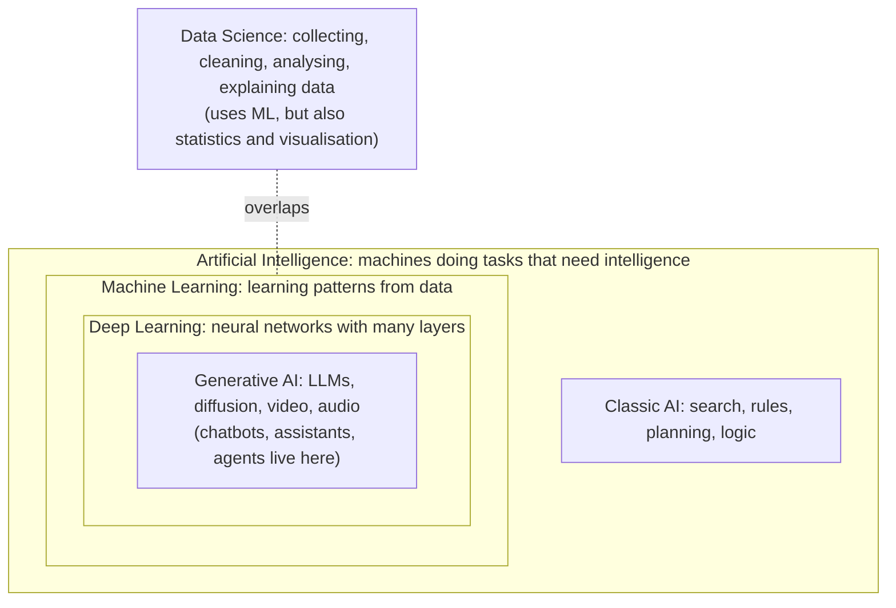
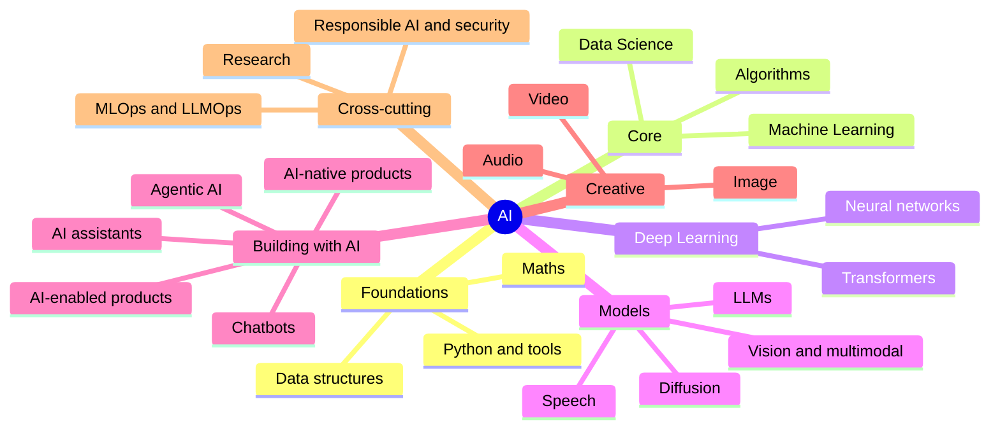
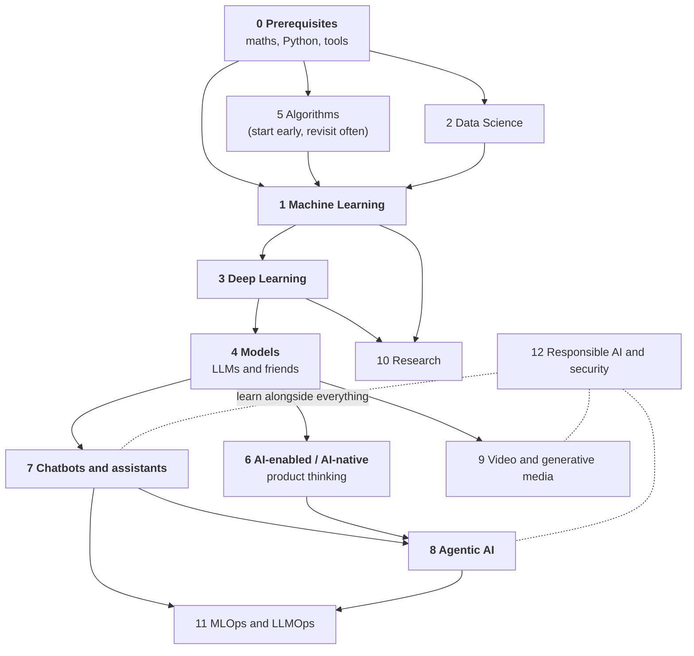

# AI Learning Roadmap

A complete, structured map for learning AI: what to know first, every branch of the field, in what order, with projects to build
and resources to learn from. It is written for developers and curious professionals; it does not assume a research background.

> **Snapshot: October 2026.** Fundamentals (maths, algorithms, classical ML, deep learning) change slowly. Tools, model names and
> prices change monthly. Pages mark fast-moving content, so treat named products as *examples to check*, not recommendations.

## 1. The big picture

AI is a set of nested fields. Data science overlaps with them rather than sitting inside them.



## 2. Every branch at a glance



| # | Branch | In one line | Guide |
|---|--------|-------------|-------|
| 0 | **Prerequisites** | Maths, Python, data structures, tools: what you need first and how to check you have it | [00-prerequisites](roadmap/00-prerequisites.md) |
| 1 | **Machine Learning** | Teaching programs to learn patterns from data: the core algorithms and how to judge them | [01-machine-learning](roadmap/01-machine-learning.md) |
| 2 | **Data Science** | Turning raw data into decisions: SQL, statistics, analysis, experiments, storytelling | [02-data-science](roadmap/02-data-science.md) |
| 3 | **Deep Learning** | Neural networks, from a single neuron to the transformer | [03-deep-learning](roadmap/03-deep-learning.md) |
| 4 | **Models** | The model families (LLM, vision, diffusion, speech), how to choose, adapt and run them | [04-models](roadmap/04-models.md) |
| 5 | **Algorithms** | An atlas: classic CS, search, optimisation, probabilistic, RL, retrieval, generative | [05-algorithms](roadmap/05-algorithms.md) |
| 6 | **AI-enabled vs AI-native** | Adding AI to a product, versus a product that cannot exist without it | [06-ai-enabled-and-ai-native](roadmap/06-ai-enabled-and-ai-native.md) |
| 7 | **Chatbots and AI assistants** | From rule-based bots to RAG assistants, with voice and memory | [07-chatbots-and-assistants](roadmap/07-chatbots-and-assistants.md) |
| 8 | **Agentic AI** | Systems that plan, use tools and act: patterns, protocols, safety | [08-agentic-ai](roadmap/08-agentic-ai.md) |
| 9 | **Video and generative media** | Video, image and audio generation: pipeline, tools, rights | [09-video-and-generative-media](roadmap/09-video-and-generative-media.md) |
| 10 | **Research** | Reading papers, reproducing results, designing experiments | [10-research](roadmap/10-research.md) |
| 11 | **MLOps and LLMOps** | Getting models into production and keeping them healthy | [11-mlops-and-llmops](roadmap/11-mlops-and-llmops.md) |
| 12 | **Responsible AI and security** | Bias, privacy, hallucination, prompt injection, regulation | [12-responsible-ai-and-security](roadmap/12-responsible-ai-and-security.md) |

Supporting material:

| Folder | Contents |
|--------|----------|
| [glossary/keywords.md](glossary/keywords.md) | About 185 keywords grouped by branch, one line each |
| [paths/learning-paths.md](paths/learning-paths.md) | Ordered routes for six goals, with time estimates |
| [projects/project-ladder.md](projects/project-ladder.md) | 3 projects per level, from first notebook to production agent |
| [resources/resources.md](resources/resources.md) | Courses, books, docs and communities, by branch |

## 3. How the branches depend on each other

Follow the arrows. You do not need to finish a branch before starting the next one; the **bold boxes are the minimum** for anyone
who wants to build with AI.



**Two shortcuts, one warning.**

- *You want to build AI features now:* do [0](roadmap/00-prerequisites.md) (Python only), skim [1](roadmap/01-machine-learning.md) and
  [3](roadmap/03-deep-learning.md) for vocabulary, then go to [4](roadmap/04-models.md), [7](roadmap/07-chatbots-and-assistants.md)
  and [8](roadmap/08-agentic-ai.md). You can ship useful things in weeks.
- *You want to understand how it works, or do research:* take the full order, 0 → 1 → 3 → 4, and read [10](roadmap/10-research.md) early.
- *Warning:* skipping evaluation, security and cost thinking is what makes AI demos fail in production. Branches
  [11](roadmap/11-mlops-and-llmops.md) and [12](roadmap/12-responsible-ai-and-security.md) are not optional extras.

## 4. Levels

| Level | Name | Branches | Outcome | Rough time at about 8 h/week* |
|-------|------|----------|---------|------------------------------|
| L0 | Foundations | 0, start of 5 | You can write Python, read basic maths, use git and notebooks | 6 to 10 weeks |
| L1 | Core | 1, 2, rest of 5 | You can build and honestly evaluate a model on tabular data and explain a dataset | 12 to 16 weeks |
| L2 | Deep learning and models | 3, 4 | You can train a small network, fine-tune a pre-trained model and choose the right model for a job | 10 to 14 weeks |
| L3 | Applied | 6, 7 | You can ship a chatbot or assistant with retrieval, evaluation and guardrails | 6 to 10 weeks |
| L4 | Agentic and native | 8, 11, 12 | You can build, test and operate agents safely and reason about AI-native products | 8 to 12 weeks |
| L5 | Specialise | 9, 10, or deeper in any branch | Depth in one area: media, research, infrastructure, safety | open-ended |

\*Estimates, not promises. They assume steady practice and building projects, not only watching videos. Someone with strong
programming experience can often shorten L0 and parts of L1 considerably.

## 5. How to use this roadmap

1. **Pick a path** in [learning-paths.md](paths/learning-paths.md) that matches your goal, or follow the dependency diagram above.
2. **For each branch:** read its guide, work through the topic table in order, and use the *check yourself* column honestly.
3. **Build the projects** from the [project ladder](projects/project-ladder.md). Projects, not courses, are what make knowledge stick.
4. **Keep the glossary open** in a tab; look up every unfamiliar keyword the first time you meet it.
5. **Stop when the "done when" list is true** for that branch, then move on. Perfectionism is the main reason people stall.

Each branch guide has the same layout: what it is, prerequisites, topics in order, tools, projects, "done when", common mistakes.

## 6. Worked examples in the author's repositories

Small projects from the same author illustrate several branches (they are separate repositories, not part of this one):

| Project | Branch it illustrates |
|---------|-----------------------|
| `nlp-uima-medical-demo`: rule-based clinical NLP pipeline (sections, negation, vocabulary codes) | Classic NLP and rules, before LLMs, and how to evaluate them (branches 1, 5, 6) |
| `pdf-ocr-extractor` (branch `ocr-app`): OCR from scanned PDFs | Computer vision in production, pre-processing, batch processing (branches 3, 6, 11) |
| `ai-enabled-bu-app`: design for an automated customer-feedback system | An **AI-enabled** product with honest limits (branches 6, 7, 12) |

## 7. Contributing and keeping it current

- Fundamentals pages are reviewed rarely; tool and model examples carry a *snapshot date* and should be rechecked before relying on them.
- Found a broken link or an outdated statement? Open an issue or pull request with a source.
- Every claim about a specific product or price should link to its source.

## 8. Repository layout

```
README.md                      you are here
roadmap/                       one guide per branch (00 to 12)
glossary/keywords.md           keywords by branch
paths/learning-paths.md        routes by goal
projects/project-ladder.md     projects by level
resources/resources.md         courses, books, docs, communities
```
