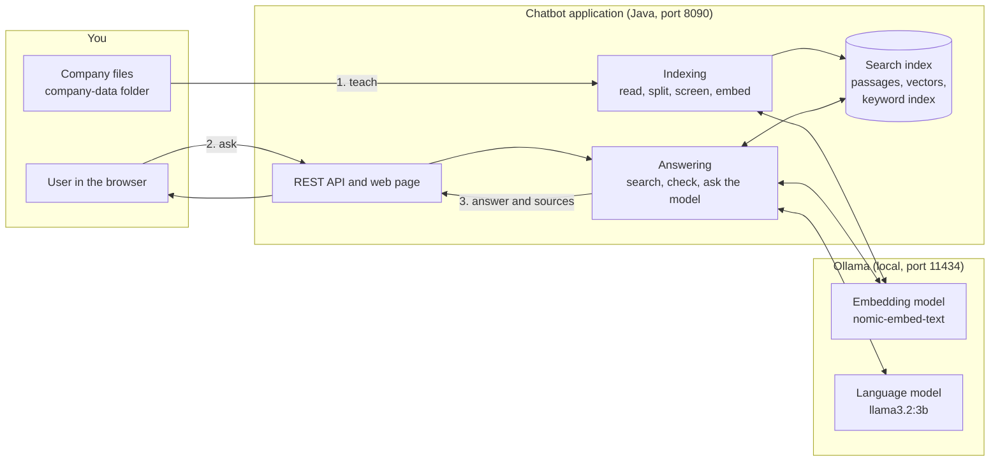
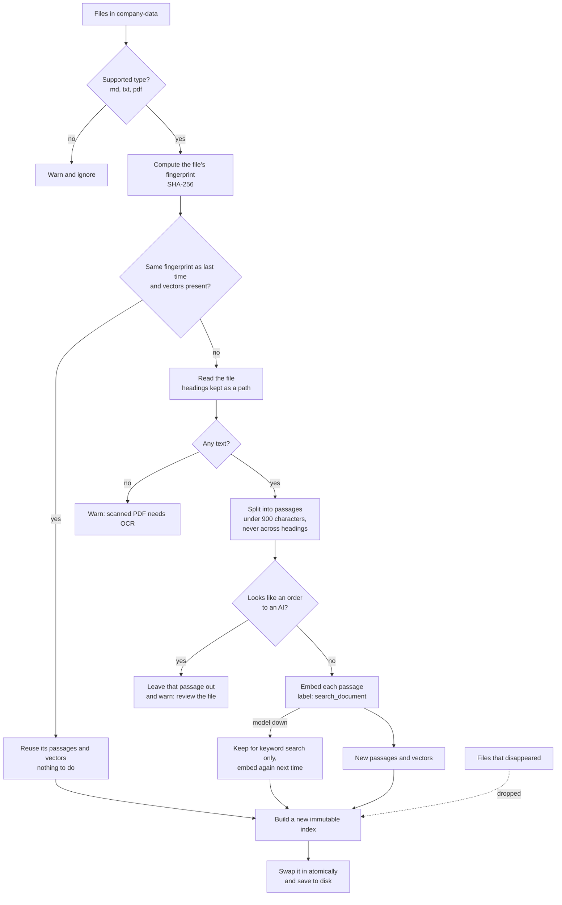
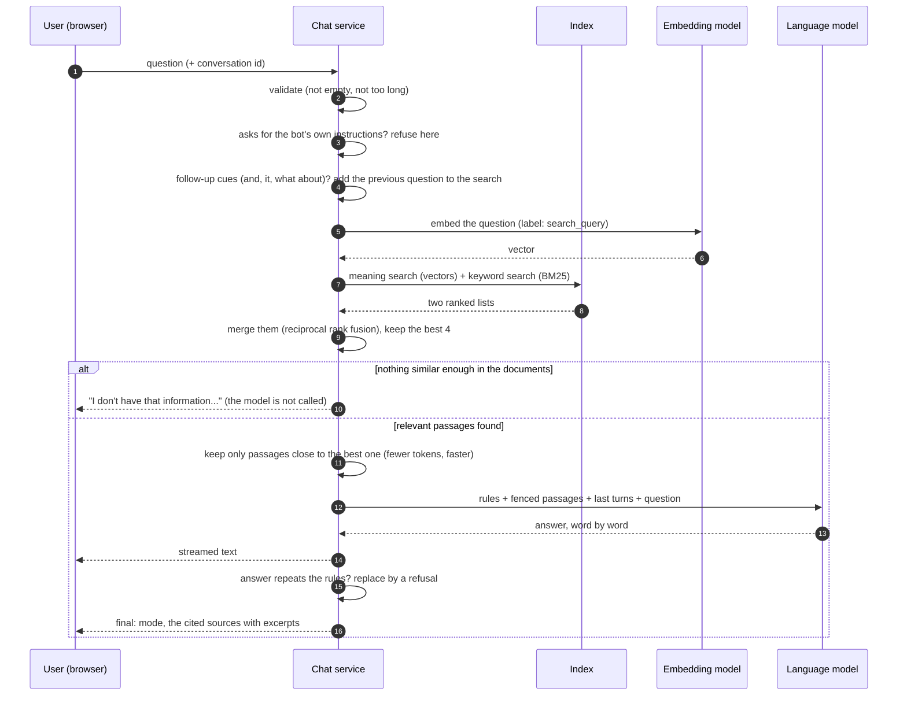
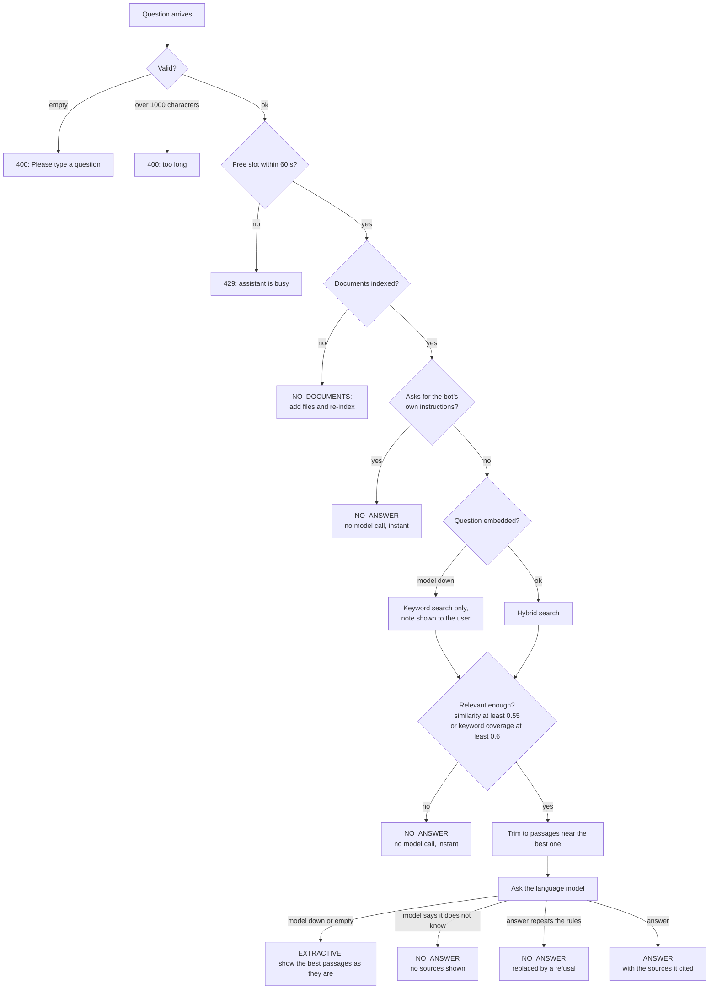
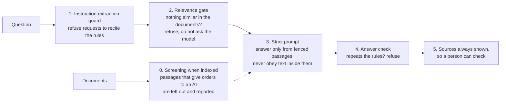
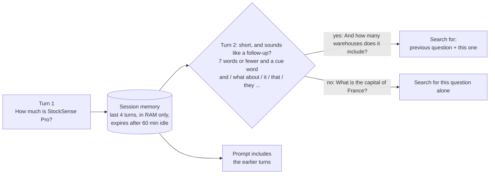

# Flow diagrams

How the chatbot works, step by step. Diagrams are Mermaid and render on GitHub.

## 1. The whole system

Everything runs on one computer. Nothing is sent to the internet after the models are downloaded.

## 2. "Training": from files to a searchable index

This is the only step that makes the bot "know" the company. It takes seconds, needs no model training, and is repeated
whenever the files change (button **Re-index documents**, or `POST /api/ingest`, or at start-up).

Why it is incremental: a file is identified by the fingerprint of its content, so unchanged files cost nothing, an edited file is
re-embedded alone, and a deleted file disappears from the answers at the next indexing run.

## 3. Answering one question

## 4. Every way a question can end

| Result (`mode`) | Meaning | What the user sees |
|-----------------|---------|--------------------|
| `ANSWER` | The model answered from the passages | The answer and its sources |
| `NO_ANSWER` | The documents do not cover it (decided by a guard, the relevance gate or the model) | "I don't have that information in the company documents." |
| `EXTRACTIVE` | The model was unavailable | The most relevant passages, with a note |
| `NO_DOCUMENTS` | Nothing has been indexed yet | A hint to add files and re-index |

## 5. The layers against made-up answers and manipulation

Layer 2 is cheap and instant but coarse: a question that merely shares a topic with the documents ("weather in Pune") passes it, and
layer 3 declines it at the cost of a model call. Layers 0, 1 and 4 are pattern-based heuristics: they stop the common attacks, not
every possible one. The [README](../README.md#how-well-does-it-work) reports what was measured, including what is not covered.

## 6. Conversation memory

A short question on a new topic must not inherit the old topic: merging "What is the capital of France?" with the previous
company question made it look company-related and cost a full model call, which is why the cue words are required.
Memory is kept per conversation id, in memory only; nothing is written to disk, and a restart forgets all conversations.
