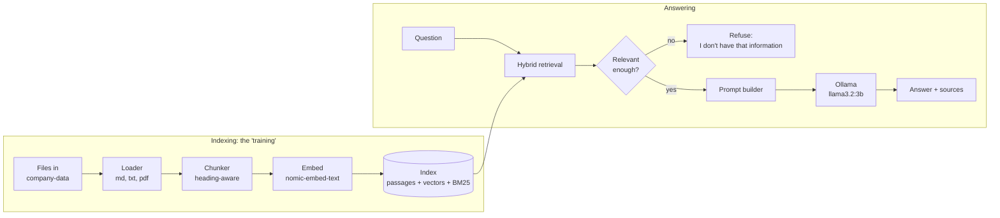

# Tech stack

What the demo uses, why, what else was considered, and what each piece costs. Everything is **free and open source** and runs on
one Windows laptop with no accounts or API keys.

## 1. The stack

| Layer | Choice | Why | Cost |
|-------|--------|-----|------|
| Language | **Java 21** | Same as the other projects; strong typing; one jar to run | Free |
| Framework | **Spring Boot 3.5** (web) | REST, static files, configuration, tests: little code | Free |
| **Language model (answers)** | **Ollama** serving **`llama3.2:3b`** | Local, free, private; small enough for 8 GB RAM; runs on CPU | Free |
| **Embedding model (meaning search)** | Ollama serving **`nomic-embed-text`** (274 MB) | Good quality for its size; local; asymmetric prefixes for questions vs documents | Free |
| Keyword search | **BM25**, written in about 100 lines | Finds exact names, numbers and codes that embeddings blur | Free |
| Vector search | In-memory index with cosine similarity, persisted to disk | A few hundred passages need no database | Free |
| Combining the two searches | **Reciprocal rank fusion (RRF)** | Simple, robust, no tuning of score scales | Free |
| Safety checks | **Rule-based injection guard** (patterns), relevance gate, strict prompt with fenced passages | Cheap, explainable, no extra model; stops the common attacks (not all) | Free |
| Quality measurement | **Evaluation harness** in the app (`eval.bat`): questions as data, automatic scoring, dev and hold-out sets | Quality is measured, not judged by eye | Free |
| PDF reading | **Apache PDFBox 3** | Reliable text extraction | Free |
| Sessions | **Caffeine** cache | In-process, expiring conversation memory | Free |
| Web UI | One HTML file, plain JavaScript, server-sent events | No build step, no Node needed to run | Free |
| Build | **Maven** (wrapper included) | Standard | Free |
| Tests | **JUnit 5**, AssertJ, MockMvc, a fake Ollama server | Repeatable tests without a model | Free |
| Scripts | `setup.bat`, `run.bat`, `eval.bat` | One-command local use | n/a |

Python is not used: it is not installed on the target machine, and Java keeps this consistent with the other demos.

## 2. Components and their roles

## 3. Why these decisions

| Decision | Reason | Alternative and why not (for the demo) |
|----------|--------|----------------------------------------|
| **RAG, not fine-tuning** | Facts change; RAG updates in seconds and shows its sources | Fine-tuning: slow, costly, cannot guarantee facts |
| **Hybrid search** | Embeddings handle paraphrase; BM25 handles exact terms such as "ISO 27001" or "99.9%" | Vectors only: misses exact tokens; keywords only: misses paraphrase |
| **Heading-aware chunks** | A passage that carries its heading ("Pricing > Pro plan") is found and understood far more reliably than an arbitrary 500-character slice | Fixed-size chunks: split tables and lists in half |
| **Relevance gate before the model** | The cheapest, most reliable way to stop made-up answers for off-topic questions is to not call the model at all | Rely on the prompt alone: models often answer anyway |
| **Own code instead of LangChain4j or Spring AI** | Few lines, nothing hidden, nothing to learn first; the roadmap's advice is to learn the raw loop before adopting a framework | Frameworks are a good next step for larger systems |
| **In-memory index** | Hundreds of passages; no service to run | pgvector, Qdrant, Chroma, Milvus for millions of passages |
| **Local model** | Free, private, no key; demonstrates that company data need not leave the machine | Hosted models answer better; one config change switches |
| **Plain HTML UI** | Setup stays at "Java + Ollama" | Angular or React for a product UI |
| **temperature 0** | Repeatable answers for testing and for factual Q&A | Higher temperature suits creative writing, not company facts |
| **Send the model only the best-matching passages** | On a laptop CPU the model reads about 23 tokens a second, so every extra passage costs seconds; fewer, closer passages are also less to distract a small model | Always sending the top 4: slower and noisier |
| **Rule-based injection guard, not a classifier model** | Free, instant, explainable; a second model would cost another 10+ seconds per question on this hardware | A trained or LLM-based classifier catches more but costs time and needs its own evaluation |

## 4. Requirements on the machine

| Requirement | Notes |
|-------------|-------|
| Windows 10/11, **JDK 21+** | Maven is not needed: the wrapper downloads it |
| **Ollama** ([ollama.com](https://ollama.com)) | `setup.bat` pulls the two models if missing (about 2.3 GB, once) |
| RAM | 8 GB works; the 3B model needs about 2 GB plus the app |
| GPU | Not required. Without one, answers take several seconds to a minute depending on the CPU |
| Disk | About 3 GB for models |
| Internet | Only to download models and Maven dependencies the first time; afterwards fully offline |

## 5. Swapping the model

Everything model-related is in `application.yml` or environment variables (`CHATBOT_LLM_MODEL`, `CHATBOT_EMBED_MODEL`,
`CHATBOT_OLLAMA_URL`). Larger local models (for example a 7 to 8 billion parameter model) answer more carefully but need more
RAM; hosted models would need a different client class (the `OllamaClient` is the only code that talks to a model). **Whatever
you switch to, run `eval.bat` before and after and compare**: changing the embedding model also requires re-indexing, which the
app does automatically because the index records which embedding model built it.
