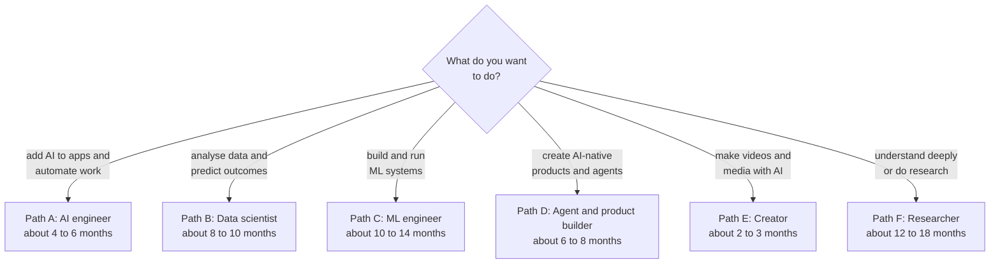

# Learning paths

Six routes through the roadmap, by goal. Each lists the branches **in order**, what to skip for now, and what you can do at
the end. Estimates assume about **8 hours a week** of real practice and project building; they are guides, not promises, and
prior programming experience shortens them.

[← Back to the roadmap](../README.md)

## Choose your path

## Path A: AI engineer (build features, chatbots and assistants into products)

**For:** software developers who want to ship AI features quickly.

| Order | Branch | Depth | Weeks |
|------:|--------|-------|------:|
| 1 | [0 Prerequisites](../roadmap/00-prerequisites.md): Python, APIs, git; statistics intuition only | Basic | 2 to 4 |
| 2 | [4 Models](../roadmap/04-models.md): API calls, prompting, embeddings, choosing models | Solid | 3 to 4 |
| 3 | [7 Chatbots and assistants](../roadmap/07-chatbots-and-assistants.md): flows, RAG, evaluation | Solid | 4 to 6 |
| 4 | [6 AI-enabled vs AI-native](../roadmap/06-ai-enabled-and-ai-native.md): scoping, metrics, fallbacks | Solid | 2 to 3 |
| 5 | [12 Responsible AI and security](../roadmap/12-responsible-ai-and-security.md): injection, privacy | Solid | 2 |
| 6 | [8 Agentic AI](../roadmap/08-agentic-ai.md): tools, workflows, limits | Working | 4 to 6 |
| 7 | [11 MLOps and LLMOps](../roadmap/11-mlops-and-llmops.md): tracing, evaluation gates, cost | Working | 3 to 4 |
| later | [1 ML](../roadmap/01-machine-learning.md) and [3 Deep learning](../roadmap/03-deep-learning.md) | Skim for vocabulary | as needed |

**Skip for now:** most maths, training models from scratch.
**You can then:** ship a RAG assistant, add AI features to an existing product with evaluation and fallbacks, and build a safe tool-using agent.

## Path B: Data scientist

**For:** analysts and anyone who wants to answer questions and predict outcomes from data.

| Order | Branch | Depth | Weeks |
|------:|--------|-------|------:|
| 1 | [0 Prerequisites](../roadmap/00-prerequisites.md): Python, SQL, statistics, some linear algebra | Solid | 6 to 10 |
| 2 | [2 Data science](../roadmap/02-data-science.md): SQL, EDA, statistics, experiments, storytelling | Solid | 8 to 10 |
| 3 | [1 Machine learning](../roadmap/01-machine-learning.md): models, metrics, validation | Solid | 8 to 10 |
| 4 | [5 Algorithms](../roadmap/05-algorithms.md): the ML and optimisation parts | Working | alongside |
| 5 | [3 Deep learning](../roadmap/03-deep-learning.md): basics, transfer learning | Working | 6 to 8 |
| 6 | [4 Models](../roadmap/04-models.md) and [7 Chatbots](../roadmap/07-chatbots-and-assistants.md): to use LLMs in analysis | Working | 4 to 6 |
| 7 | [12 Responsible AI](../roadmap/12-responsible-ai-and-security.md): fairness, privacy | Solid | 2 |

**You can then:** take a business question to a decision with honest uncertainty, build and evaluate predictive models, and run experiments.

## Path C: ML engineer

**For:** engineers who will train, deploy and operate models.

| Order | Branch | Depth | Weeks |
|------:|--------|-------|------:|
| 1 | [0 Prerequisites](../roadmap/00-prerequisites.md) including linear algebra and calculus | Working | 6 to 10 |
| 2 | [1 Machine learning](../roadmap/01-machine-learning.md) | Solid | 8 to 10 |
| 3 | [5 Algorithms](../roadmap/05-algorithms.md) | Working | alongside |
| 4 | [3 Deep learning](../roadmap/03-deep-learning.md) | Solid | 8 to 10 |
| 5 | [4 Models](../roadmap/04-models.md): fine-tuning, serving, quantisation | Solid | 6 |
| 6 | [11 MLOps and LLMOps](../roadmap/11-mlops-and-llmops.md) | Solid | 8 to 10 |
| 7 | [2 Data science](../roadmap/02-data-science.md): the data and statistics parts | Working | 4 |
| 8 | [12 Responsible AI and security](../roadmap/12-responsible-ai-and-security.md) | Solid | 2 to 3 |
| 9 | [7 Chatbots](../roadmap/07-chatbots-and-assistants.md) and [8 Agents](../roadmap/08-agentic-ai.md) | Working | 6 |

**You can then:** take a model from experiment to a monitored, versioned production service with automated evaluation.

## Path D: Agent and AI-native product builder

**For:** founders, product engineers and architects designing AI-native products.

| Order | Branch | Depth | Weeks |
|------:|--------|-------|------:|
| 1 | [0 Prerequisites](../roadmap/00-prerequisites.md): Python or your language, APIs | Basic | 2 to 4 |
| 2 | [4 Models](../roadmap/04-models.md) | Solid | 4 |
| 3 | [6 AI-enabled vs AI-native](../roadmap/06-ai-enabled-and-ai-native.md) | Solid | 3 |
| 4 | [7 Chatbots and assistants](../roadmap/07-chatbots-and-assistants.md) | Solid | 5 |
| 5 | [8 Agentic AI](../roadmap/08-agentic-ai.md) | Solid | 8 |
| 6 | [12 Responsible AI and security](../roadmap/12-responsible-ai-and-security.md) | Solid | 3 |
| 7 | [11 MLOps and LLMOps](../roadmap/11-mlops-and-llmops.md) | Working | 4 |
| 8 | [2 Data science](../roadmap/02-data-science.md): metrics and experiments | Working | 3 |
| optional | [9 Video and media](../roadmap/09-video-and-generative-media.md) | Working | 3 |

**You can then:** design, build and operate an AI-native product with evaluation, guardrails and cost control, and know when *not* to use an agent.

## Path E: Creator (video and generative media)

**For:** marketers, educators, storytellers and designers.

| Order | Branch | Depth | Weeks |
|------:|--------|-------|------:|
| 1 | [9 Video and generative media](../roadmap/09-video-and-generative-media.md): creator track | Solid | 4 to 6 |
| 2 | [4 Models](../roadmap/04-models.md): the generative families, prompting basics | Basic | 1 to 2 |
| 3 | [12 Responsible AI](../roadmap/12-responsible-ai-and-security.md): rights, consent, disclosure | Solid | 1 |
| optional | Basic Python and the technical track of branch 9 (ComfyUI, FFmpeg) | Working | 4 to 6 |

**You can then:** take an idea to a finished, captioned, properly labelled AI-assisted video through a repeatable process.

## Path F: Researcher

**For:** those aiming at graduate study, research roles or deep understanding.

| Order | Branch | Depth | Weeks |
|------:|--------|-------|------:|
| 1 | [0 Prerequisites](../roadmap/00-prerequisites.md) with strong linear algebra, calculus, probability | Strong | 10 to 16 |
| 2 | [1 Machine learning](../roadmap/01-machine-learning.md) | Strong | 10 |
| 3 | [5 Algorithms](../roadmap/05-algorithms.md) | Strong | alongside |
| 4 | [3 Deep learning](../roadmap/03-deep-learning.md): implement a transformer from scratch | Strong | 10 to 12 |
| 5 | [10 Research](../roadmap/10-research.md): start reading papers here, reproduce a result | Solid | continuous |
| 6 | [4 Models](../roadmap/04-models.md): evaluation, fine-tuning | Solid | 6 |
| 7 | One specialisation: language, vision, RL, interpretability, AI for science, safety | Deep | 12+ |
| 8 | [12 Responsible AI](../roadmap/12-responsible-ai-and-security.md) | Solid | 3 |

**You can then:** reproduce published work, design fair experiments and contribute a small, honest result.

## Weekly routine (any path)

| Time | Activity |
|------|----------|
| 3 hours | Learn: one topic from the branch guide |
| 4 hours | Build: the current project, written yourself |
| 1 hour | Review: update notes, look up keywords in the [glossary](../glossary/keywords.md), read one paper or article |

## Signs you are ready to move on

- You can explain the branch's central ideas to someone else.
- Every "check yourself" box in the topic table is true.
- You have one finished, documented project in the branch.
- The branch's **Done when** list is true.
