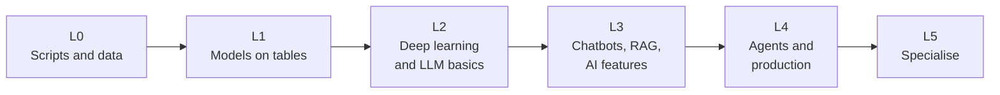

# Project ladder

Projects are how knowledge becomes skill. Each level has three projects; do at least one per level before moving up. Keep every
project in its own repository with a README that states the problem, how to run it, the result and **the limits**.

[← Back to the roadmap](../README.md)

## The ladder



## L0: Foundations

| Project | What you build | You practise |
|---------|----------------|--------------|
| **Data cleaner** | A script that reads messy CSVs, fixes types, missing values and duplicates, writes a clean file and a report | Python, pandas, tests |
| **API collector** | A program that calls a public API daily, stores results in SQLite, and plots a trend | HTTP, JSON, SQL, scheduling |
| **Algorithm kit** | Implement binary search, BFS, k-means and gradient descent from scratch with tests | [Algorithms](../roadmap/05-algorithms.md), testing |

## L1: Machine learning and data science

| Project | What you build | You practise |
|---------|----------------|--------------|
| **Predict and explain** | A tabular model (prices or churn) with a baseline, cross-validation, the right metric and SHAP explanations | [ML](../roadmap/01-machine-learning.md) |
| **A/B test analysis** | Simulate or analyse an experiment: power, result, interval, recommendation | [Data science](../roadmap/02-data-science.md) |
| **Dashboard** | SQL to cleaned data to a dashboard that answers one stated business question | SQL, visualisation, storytelling |

## L2: Deep learning and models

| Project | What you build | You practise |
|---------|----------------|--------------|
| **Image classifier** | Transfer learning on your own small image set | [Deep learning](../roadmap/03-deep-learning.md) |
| **Tiny transformer** | A character-level language model trained on a small text, with a write-up of every component | Attention, training loops |
| **Model shoot-out** | Compare a local and an API LLM on 50 of your own questions: quality, cost, latency | [Models](../roadmap/04-models.md) |

## L3: Chatbots, assistants and AI features

| Project | What you build | You practise |
|---------|----------------|--------------|
| **Telegram booking bot** | A flow-based bot that collects a name and phone number with validation and confirmation | [Chatbots](../roadmap/07-chatbots-and-assistants.md) |
| **Document Q&A (RAG)** | An assistant over your own PDFs (OCR for scans) with citations, "I don't know" and a 50-question test set | RAG, evaluation |
| **AI feature in a real app** | Add one AI feature (extract, classify or draft) to an existing app with review, fallback and cost log | [AI-enabled](../roadmap/06-ai-enabled-and-ai-native.md) |

## L4: Agents and production

| Project | What you build | You practise |
|---------|----------------|--------------|
| **Tool-using assistant** | Three tools, a step and cost limit, full tracing | [Agentic AI](../roadmap/08-agentic-ai.md) |
| **Research agent** | Searches sources, extracts evidence, writes a cited report; scored on 20 questions; injection-tested | Agents, evaluation, security |
| **Production service** | Containerise an LLM app with CI evaluation gate, tracing, cost dashboard and a rollback plan | [MLOps](../roadmap/11-mlops-and-llmops.md) |

## L5: Specialise

| Specialisation | Capstone |
|----------------|----------|
| **Generative media** | Automated video pipeline: brief → script → shots → voice → assembly → captions, with human approval ([9](../roadmap/09-video-and-generative-media.md)) |
| **Research** | Reproduce and extend a published result with an ablation study and a write-up ([10](../roadmap/10-research.md)) |
| **Safety and security** | Red-team an agent, fix findings, publish the report ([12](../roadmap/12-responsible-ai-and-security.md)) |
| **Infrastructure** | Serve an open model efficiently with load tests and autoscaling ([11](../roadmap/11-mlops-and-llmops.md)) |
| **Domain** | An AI-native or AI-enabled product for one industry you know (health, finance, education, retail) with a real user |

## Project template (copy into each README)

```markdown
# Project name
**Problem:** who needs what, and how success is measured.
**Approach:** data, model/method, why this choice.
**Results:** the numbers, with the baseline and test set stated.
**Limits and failures:** where it does not work, and why.
**Cost and privacy:** what it costs to run, what data it touches.
**How to run:** commands that work from a fresh clone.
```

## Rules of thumb

1. **Finish small projects.** A working, documented small project beats an abandoned ambitious one.
2. **Baseline first,** then improve, and show both.
3. **Write down the limits.** Honest limits are the sign of a professional.
4. **Build an evaluation set** for anything involving an LLM.
5. **Show the cost** (compute, tokens, time) of what you built.
6. **Use real data,** with permission, as soon as you safely can.

## Where to find ideas and data

| Source | Use |
|--------|-----|
| Kaggle datasets and competitions | Practice data and notebooks |
| Hugging Face datasets and models | Ready data and pre-trained models |
| Government open-data portals | Real, public data |
| Your own work, hobbies and community | The best source of problems with real users |
