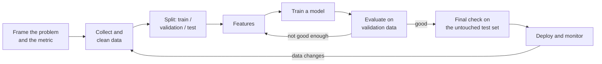

# 1. Machine Learning

Machine learning (ML) is building programs that **learn patterns from data** instead of following hand-written rules. This is the
core of the field; deep learning and generative AI are specialised, larger versions of the same ideas.

[← Roadmap](../README.md) · Previous: [0. Prerequisites](00-prerequisites.md) · Next: [2. Data Science](02-data-science.md) · [3. Deep Learning](03-deep-learning.md)

**Prerequisites:** Python with NumPy and pandas; basic statistics and probability; derivative and gradient intuition.

## The ML workflow

The most common source of false confidence is **data leakage**: information from the test set (or from the future) sneaking into
training. Split first, then do everything else using only the training data.

## Kinds of learning

| Kind | Learns from | Example task |
|------|-------------|--------------|
| **Supervised** | Examples with correct answers (labels) | Will this customer cancel? What is this house worth? |
| **Unsupervised** | Data without labels | Group similar customers; find unusual transactions |
| **Semi- and self-supervised** | A little labelled data plus a lot of unlabelled data, or labels made from the data itself | Pre-training language models by predicting the next word |
| **Reinforcement learning** | Trial, error and rewards | Game playing, robot control, tuning chatbots with feedback |

## Topics in learning order

| # | Topic | What to learn | Check yourself |
|---|-------|---------------|----------------|
| 1 | Problem framing | Classification vs regression vs clustering vs ranking; baseline first; what "good" means for the business | You can say what a "dumb baseline" is for your problem |
| 2 | Data splitting | Train / validation / test, cross-validation, time-based splits, stratification | You can explain leakage with an example |
| 3 | Linear and logistic regression | Fitting a line, coefficients, regularisation (L1/L2), probabilities | You can interpret a coefficient and say when a linear model is enough |
| 4 | Metrics | Accuracy, precision, recall, F1, ROC-AUC, PR-AUC, confusion matrix; MAE, RMSE, R²; calibration | You know why accuracy is misleading when 99% of cases are negative |
| 5 | Bias, variance, overfitting | Learning curves, underfit vs overfit, regularisation, early stopping | You can read a learning curve and say what to do next |
| 6 | Trees and ensembles | Decision trees, random forests, **gradient boosting** (XGBoost, LightGBM, CatBoost) | You know why boosted trees often win on tabular data |
| 7 | Other classic models | k-nearest neighbours, naive Bayes, support vector machines | You can say when each is a reasonable choice |
| 8 | Feature engineering | Encoding categories, scaling, dates, text and missing values, interactions, target leakage | You can build a pipeline that applies the same steps to new data |
| 9 | Hyper-parameter tuning | Grid / random / Bayesian search, nested validation | You tune on validation data, never on the test set |
| 10 | Unsupervised learning | k-means, hierarchical, DBSCAN, PCA, t-SNE/UMAP, anomaly detection | You can explain what PCA keeps and discards |
| 11 | Model explanation | Feature importance, permutation importance, SHAP, partial dependence | You can explain one prediction to a non-expert |
| 12 | Recommenders and time series (intro) | Collaborative filtering, matrix factorisation; trend, seasonality, forecasting baselines | You can beat "tomorrow = today" for a forecast, or explain why you cannot |
| 13 | Reinforcement learning (intro) | Agent, environment, reward, policy; Q-learning idea | You can describe the loop in one paragraph; see [algorithms](05-algorithms.md#reinforcement-learning) |
| 14 | Model hygiene | Reproducibility, saving models, pipelines, simple monitoring | Someone else can retrain your model from your repo |

## Tools

| Tool | Use |
|------|-----|
| **scikit-learn** | The standard library for classic ML: models, pipelines, metrics, validation |
| pandas / Polars, NumPy | Data handling |
| XGBoost, LightGBM, CatBoost | Gradient boosting |
| Matplotlib, Seaborn, Plotly | Plotting |
| SHAP | Explanations |
| Optuna | Hyper-parameter search |
| MLflow, Weights & Biases | Experiment tracking (see [MLOps](11-mlops-and-llmops.md)) |
| Kaggle | Free notebooks, datasets and competitions for practice |

## Projects

| Level | Project |
|-------|---------|
| Starter | Predict house prices or passenger survival from a public dataset; compare a baseline, linear model and random forest; report honest error |
| Intermediate | Customer-churn model with a proper pipeline, cross-validation, threshold choice based on cost, and SHAP explanations |
| Stretch | A forecasting or recommendation system evaluated with a time-based split; write a one-page model card stating limits |

## Done when

- You can take a table of data, build a baseline and a stronger model, and **evaluate them without leakage**.
- You can pick a metric to match a business cost and defend it.
- You can say why a model is overfitting and name three fixes.
- You can explain one prediction in plain language.

## Common mistakes

- **Evaluating on training data**, or tuning repeatedly on the test set.
- **Reporting accuracy** on imbalanced data.
- **Starting with a complicated model** instead of a baseline.
- **Leaking the future** (using a column that is only known after the outcome).
- **Ignoring data quality:** more gains usually come from better data than a fancier algorithm.
