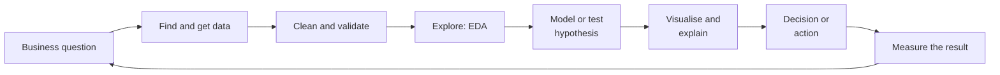

# 2. Data Science

Data science turns raw data into **decisions**: asking the right question, getting and cleaning the data, analysing it, running
experiments, and explaining the result so someone acts on it. ML is one tool inside it; statistics, SQL and communication are the others.

[← Roadmap](../README.md) · Previous: [1. Machine Learning](01-machine-learning.md) · Next: [3. Deep Learning](03-deep-learning.md)

**Prerequisites:** Python (pandas), SQL basics, statistics intuition.

## The data science loop

## Data science vs related roles

| Role | Main question | Main tools |
|------|---------------|------------|
| Data analyst | What happened and why? | SQL, spreadsheets, BI tools |
| **Data scientist** | What will happen, what should we do, did it work? | Python, statistics, ML, experiments |
| Data engineer | How does reliable data reach everyone? | SQL, pipelines, warehouses, cloud |
| ML engineer | How do we run this model reliably in production? | Python, serving, MLOps |
| AI engineer | How do we build products on top of existing models? | APIs, RAG, agents, evaluation |

## Topics in learning order

| # | Topic | What to learn | Check yourself |
|---|-------|---------------|----------------|
| 1 | Asking questions | Turning a vague request into a measurable question and a decision | You can write the question, the metric and what you would do with each answer |
| 2 | SQL | Joins, aggregations, window functions, CTEs, query plans | You can compute a 7-day rolling average in SQL |
| 3 | Data cleaning | Missing values, duplicates, outliers, inconsistent formats, units, time zones | You can list the data-quality checks you ran before trusting a column |
| 4 | Exploratory analysis (EDA) | Distributions, summaries, correlations, segments, plots | You found at least one thing in the data that surprised you and checked it |
| 5 | Statistics for decisions | Sampling, confidence intervals, hypothesis tests, effect size, multiple comparisons, power | You can say why "p < 0.05" does not mean "important" |
| 6 | Visualisation | Choosing the chart for the question, avoiding misleading axes, colour and accessibility | A reader gets the point in 10 seconds without a legend lecture |
| 7 | Experiments and A/B testing | Randomisation, sample size, guardrail metrics, novelty effect, stopping rules | You can design a test and explain why peeking inflates false positives |
| 8 | Causal thinking | Confounders, selection bias, correlation vs causation, observational methods (intro) | You can spot a confounder in a news headline |
| 9 | Modelling | Apply [machine learning](01-machine-learning.md) where prediction is the goal | You choose a model by the decision it supports |
| 10 | Time series | Trend, seasonality, stationarity, forecasting baselines | You can explain why random splits are wrong for time data |
| 11 | Storytelling and dashboards | Narrative, one message per chart, BI tools, reproducible reports | A non-technical manager can act on your slide |
| 12 | Data engineering basics | ETL/ELT, warehouses, data models, data quality tests, dbt (intro) | You can describe how a number gets from a source system to a dashboard |
| 13 | Data ethics | Consent, privacy, fairness; see [Responsible AI](12-responsible-ai-and-security.md) | You can say which columns in a dataset are personal data |

## Tools

| Tool | Use |
|------|-----|
| SQL (PostgreSQL, MySQL, **DuckDB** for local analytics) | Querying data |
| pandas, Polars | Data wrangling in Python |
| Jupyter, Quarto | Analysis and reports |
| Matplotlib, Seaborn, Plotly, Altair | Charts |
| Superset, Metabase, Power BI, Tableau, Looker Studio | Dashboards (some free) |
| statsmodels, SciPy | Statistics |
| dbt, Airflow, Dagster | Data pipelines (later) |

## Projects

| Level | Project |
|-------|---------|
| Starter | EDA report on a public dataset with five findings, each backed by a chart and a caveat |
| Intermediate | Analyse a (simulated or real) A/B test: sample size, result, confidence interval, recommendation |
| Stretch | End-to-end: SQL → clean → model → dashboard, refreshed by a scheduled job, with data-quality tests |

## Done when

- You can take a vague business question to a decision backed by data and honest uncertainty.
- You can write non-trivial SQL and pandas without help.
- You can design and read an experiment correctly.
- You can present a result so that the audience knows what to do next.

## Common mistakes

- **Skipping data validation**, then explaining an error as an insight.
- **Hunting for significance** (testing many things, reporting the one that worked).
- **Dashboards nobody uses.** Start from a decision, not from available columns.
- **Treating correlation as cause.**
- **Using ML when a simple count or rule would do.**
