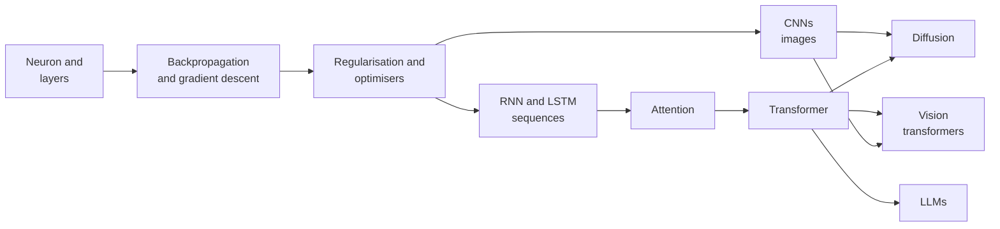

# 3. Deep Learning

Deep learning uses **neural networks with many layers** to learn directly from raw data such as pixels, audio and text. It is the
engine behind modern vision, speech and language models, including the large language models used in chatbots and agents.

[← Roadmap](../README.md) · Previous: [1. Machine Learning](01-machine-learning.md) · Next: [4. Models](04-models.md)

**Prerequisites:** [Machine learning](01-machine-learning.md) (especially overfitting and evaluation); Python; linear algebra and
the chain rule (intuition is enough to start).

## How the pieces build on each other

## Topics in learning order

| # | Topic | What to learn | Check yourself |
|---|-------|---------------|----------------|
| 1 | The neuron and the network | Weights, bias, activation (ReLU, sigmoid, softmax), layers, forward pass | You can compute a 2-layer forward pass by hand |
| 2 | Loss and learning | Loss functions (MSE, cross-entropy), gradient descent, learning rate | You can explain what the learning rate does when it is too big or too small |
| 3 | Backpropagation | The chain rule through layers; autograd | You can say what `loss.backward()` computes |
| 4 | Training well | Batches, epochs, optimisers (SGD with momentum, **Adam**), initialisation, normalisation (batch, layer), dropout, weight decay, learning-rate schedules, early stopping | You can diagnose a loss that does not go down |
| 5 | Frameworks | **PyTorch** (most used in research and industry); tensors, `Dataset`/`DataLoader`, training loop, GPUs; Keras/TensorFlow and JAX are the alternatives | You can write a training loop from scratch |
| 6 | Convolutional networks | Convolution, pooling, ResNet idea, data augmentation, transfer learning | You can fine-tune a pre-trained image model on your own small dataset |
| 7 | Sequences | Embeddings, RNN, LSTM/GRU and their limits | You can say why RNNs struggle with long sequences |
| 8 | **Attention and the transformer** | Self-attention, queries/keys/values, positional information, encoder and decoder, masking | You can explain, without code, how a token "looks at" other tokens |
| 9 | Language modelling | Tokenisation (BPE), next-token prediction, pre-training, scaling | You can explain why predicting the next token teaches so much |
| 10 | Transfer learning and fine-tuning | Start from a pre-trained model; freeze layers; LoRA (see [Models](04-models.md)) | You can adapt a model with 1,000 examples instead of training from scratch |
| 11 | Generative models | Autoencoders, VAEs, GANs (history), **diffusion models** | You can describe diffusion as "learn to remove noise step by step" |
| 12 | Training at scale (overview) | GPUs and memory, mixed precision, data/model parallelism, why training big models is expensive | You can estimate whether a model fits in a given GPU's memory |
| 13 | Debugging neural networks | Overfit one batch first; check shapes, data, learning rate; compare with a baseline | A broken model is something you can systematically bisect |

## Tools

| Tool | Use |
|------|-----|
| **PyTorch** | Main framework; also Lightning to cut boilerplate |
| Hugging Face (`transformers`, `datasets`, `peft`) | Pre-trained models and fine-tuning |
| JAX | Research and high-performance work |
| TensorBoard, Weights & Biases | Training curves and experiment tracking |
| Google Colab, Kaggle, cloud GPUs | Compute; free tiers exist but are limited |
| ONNX, TorchScript | Exporting models |

## Projects

| Level | Project |
|-------|---------|
| Starter | Image classifier on a small dataset using a pre-trained CNN and transfer learning |
| Intermediate | Train a tiny language model on a text file (character level), then explain every component of the transformer you used |
| Stretch | Fine-tune a small open model on a custom task with LoRA, compare to a prompted baseline, report cost and quality |

## Done when

- You can write and debug a PyTorch training loop.
- You can explain backpropagation, attention and the transformer in plain words.
- You can fine-tune a pre-trained model and compare it fairly with a simple baseline.
- You can judge whether a problem needs deep learning at all.

## Common mistakes

- **Using deep learning where gradient boosting would win** (small tabular data).
- **Training from scratch** when a pre-trained model exists.
- **Not overfitting a tiny batch first** to check the pipeline.
- **Comparing runs with different data splits or seeds** and calling the difference real.
- **Memorising architectures** instead of understanding the ideas they combine.
