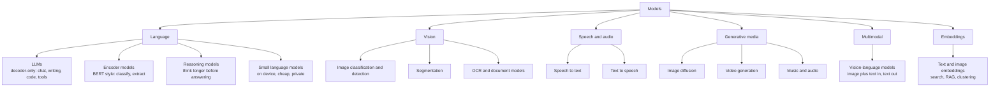
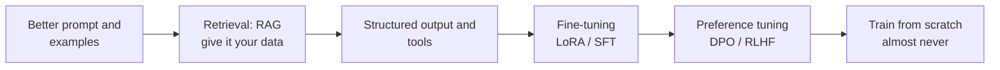

# 4. Models

"Models" here means the **families of trained AI models** you will actually use, how to choose between them, how to adapt them,
and how to run them. This is the practical bridge from deep learning theory to building products.

[← Roadmap](../README.md) · Previous: [3. Deep Learning](03-deep-learning.md) · Next: [5. Algorithms](05-algorithms.md) · [7. Chatbots](07-chatbots-and-assistants.md)

**Prerequisites:** [Deep learning](03-deep-learning.md), especially the transformer; Python and calling HTTP APIs.

> **Fast-moving.** Specific model names, versions, prices and rankings change within weeks. This page teaches *families and
> selection criteria*, which last. Check current model lists and prices at the providers' own sites before deciding.

## The model families

| Family | What it does | Typical uses | Notes |
|--------|--------------|--------------|-------|
| **Large language models (LLMs)** | Predict the next token; follow instructions | Chat, writing, summarising, coding, extraction, tool use | The engine of chatbots and agents ([7](07-chatbots-and-assistants.md), [8](08-agentic-ai.md)) |
| **Reasoning models** | LLMs trained or prompted to spend more computation "thinking" before the answer | Maths, code, multi-step problems | Slower and costlier per answer; use when accuracy beats speed |
| **Encoder models (BERT-style)** | Turn text into a representation for classification or tagging | Sentiment, named-entity recognition, search ranking | Small, fast and cheap; still the right tool for many classification jobs |
| **Embedding models** | Turn text/images into vectors where similar things are close | Semantic search, RAG, deduplication, clustering | The foundation of retrieval |
| **Vision models** | Classify, detect, segment, read documents | Quality inspection, OCR, medical imaging | CNNs and vision transformers |
| **Vision-language models** | Understand images together with text | Describe an image, read a chart, answer about a screenshot | Often part of general LLM products |
| **Speech models** | Speech to text (ASR), text to speech (TTS) | Voice assistants, transcription, dubbing | Open options exist (for example Whisper for ASR) |
| **Diffusion models** | Generate images, video and audio by removing noise step by step | Creative tools; see [9](09-video-and-generative-media.md) | |
| **Mixture of experts, state-space models** | Architecture variants for efficiency | Large-scale LLMs | Know the idea; you rarely choose one by architecture |

## Closed vs open-weight models

| | Closed (API only) | Open-weight (downloadable) |
|--|-------------------|----------------------------|
| Examples of providers/families | Anthropic, OpenAI, Google (hosted models) | Llama, Qwen, Mistral, Gemma, DeepSeek families, among others *(examples as of 2026; check current ones)* |
| Strength | Highest capability, no hardware to run, quick start | Privacy (data stays with you), customisation, predictable cost at volume, can run offline |
| Weakness | Per-use cost, data leaves your system (check terms), vendor changes | You run and secure it; usually less capable at the top end; licence terms vary |
| Use when | You need the best quality or are prototyping | Data cannot leave, cost at scale matters, or you need to fine-tune |

"Open-weight" is not always "open source": check the licence for commercial use.

## Choosing a model

Decide with a table like this, then **test on your own examples**, not on public leaderboards.

| Question | Why it matters |
|----------|----------------|
| Quality on **my** task (measure it with 50 to 200 real examples) | Benchmarks do not predict your use case |
| Latency (first token and total) | Users notice delays; voice needs speed |
| Cost per request at your volume | Often the deciding factor; smaller models are far cheaper |
| Context window and how well it uses long input | Matters for documents and conversation memory |
| Tool/function calling and structured (JSON) output | Required for agents and integrations |
| Data privacy, region, retention terms | Required for personal and regulated data |
| Licence and vendor risk | Can you switch later? Keep a thin abstraction layer |

A common pattern: **a small, cheap model for easy work and a stronger one for hard cases** (routing).

## Adapting models: cheapest first

Try each step before the next. Most products never need beyond step 3.

| Technique | What it changes | When |
|-----------|-----------------|------|
| Prompting and few-shot examples | Behaviour, tone, format | Always first |
| RAG (retrieval-augmented generation) | Knowledge: facts the model did not learn | Questions about your documents or fresh data |
| Fine-tuning (SFT, **LoRA/QLoRA**) | Style, format, narrow skills, small models doing one job well | Stable task, enough good examples, prompting is not enough |
| Preference tuning (RLHF, DPO) | Which answers are preferred | Specialist work; mostly done by model providers |
| Quantisation, distillation | Size and speed | To run on small hardware or reduce cost |

Fine-tuning teaches **behaviour and style**, not reliable new facts; for facts use retrieval.

## Running models

| Option | Notes |
|--------|-------|
| Provider APIs | Simplest; pay per token; watch rate limits and terms |
| **Ollama, llama.cpp, LM Studio** | Run open models on a laptop; good for learning and privacy |
| **vLLM, TGI, SGLang** | Serving open models efficiently on GPUs |
| Cloud platforms (managed endpoints) | Scaling and compliance features |
| On-device | Small models in phones/browsers |

Memory rule of thumb: a model needs roughly *parameters × bytes per weight* of memory, so a 7-billion-parameter model needs about
14 GB at 16-bit and about 4 GB at 4-bit quantisation, plus working memory for the conversation.

## Evaluating models

| What | How |
|------|-----|
| Your task | A fixed **evaluation set** of real inputs with expected outputs, scored automatically or by rubric; rerun on every change |
| Open-ended answers | LLM-as-judge with a clear rubric, **spot-checked by humans**; pairwise comparison |
| Safety and robustness | Adversarial and edge-case inputs; see [12](12-responsible-ai-and-security.md) |
| Public benchmarks | Useful for a rough shortlist; beware of contamination (test data leaked into training) and gaming |

## Topics in learning order

| # | Topic | Check yourself |
|---|-------|----------------|
| 1 | Tokens, context windows, temperature, top-p | You can explain why the same prompt gives different answers |
| 2 | Calling a model through an API: messages, system prompt, streaming, errors, retries | You built a small script that handles a rate-limit error |
| 3 | Prompting well: instructions, examples, delimiters, structured output | You can make a model return valid JSON reliably |
| 4 | Embeddings and vector similarity | You built a semantic search over 100 documents |
| 5 | Choosing and comparing models on your own task | You have an evaluation set and a results table |
| 6 | Running an open model locally | You served a model with Ollama and called it from code |
| 7 | Fine-tuning with LoRA (intro) | You compared a tuned model against a good prompt |
| 8 | Cost and latency engineering: caching, batching, routing, smaller models | You cut your cost per request without losing quality |

## Projects

| Level | Project |
|-------|---------|
| Starter | Compare two models (one local, one API) on 50 of your own questions; produce a quality / cost / latency table |
| Intermediate | Semantic search over a document set with embeddings; measure retrieval quality |
| Stretch | Fine-tune a small open model with LoRA for a narrow task and show when it beats prompting and when it does not |

## Done when

- You can choose a model for a task using measurements, not hype.
- You can run a model locally and through an API.
- You can explain RAG vs fine-tuning and pick correctly.
- You can estimate the cost and memory of a model for a workload.

## Common mistakes

- **Choosing by leaderboard** instead of testing on your own data.
- **Fine-tuning to add facts**; use retrieval.
- **No evaluation set**, so every change is a guess.
- **Hard-wiring one vendor** throughout the code.
- **Ignoring cost** until the first bill.
