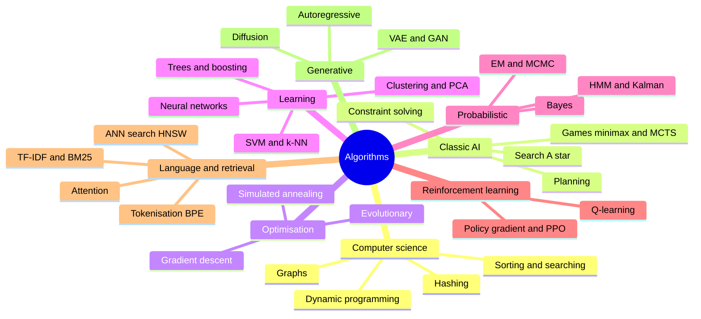

# 5. Algorithms

An atlas of the algorithms behind AI: the classic computer-science ones you need first, then the families used in search,
optimisation, learning, language, retrieval and generation. Use it as a map: for each algorithm, know **what problem it solves** and
**when to pick it**, then go deep on the ones your work needs.

[← Roadmap](../README.md) · Previous: [4. Models](04-models.md) · Next: [6. AI-enabled and AI-native](06-ai-enabled-and-ai-native.md)

**Prerequisites:** [Python and basic data structures](00-prerequisites.md). Start the "computer science" part early and revisit it
throughout; the rest follows the other branches.

## The families

## Computer science foundations

| Algorithm / idea | Solves | Pick it when | Level |
|------------------|--------|--------------|-------|
| Big-O analysis | Comparing cost as data grows | Always, before you scale | Beginner |
| Sorting (merge, quick), binary search | Ordering and fast lookup | Sorted data, ranking | Beginner |
| Hash maps and sets | Constant-time lookup, deduplication | Counting, caching, joins | Beginner |
| BFS / DFS | Exploring graphs and trees | Shortest path (unweighted), connectivity | Beginner |
| Dijkstra | Shortest path with weights | Routing, costs | Intermediate |
| Dynamic programming | Problems with overlapping sub-problems | Edit distance, sequence alignment, many optimisation tasks | Intermediate |
| Heaps and priority queues | Always get the best item next | Top-k, schedulers, A* | Intermediate |
| Union-find, tries | Grouping, prefix search | Clustering by links, autocomplete | Intermediate |

## Classic AI: search, games, planning

| Algorithm | Solves | Pick it when | Level |
|-----------|--------|--------------|-------|
| **A\*** | Shortest path using a guiding estimate (heuristic) | Maps, puzzles, robot navigation | Intermediate |
| Minimax, alpha-beta pruning | Two-player turn-based games | Small to medium game trees | Intermediate |
| Monte Carlo Tree Search (MCTS) | Games or planning with huge trees | When you can simulate outcomes | Advanced |
| Constraint satisfaction / SAT / ILP solvers | Scheduling, allocation, puzzles | Hard rules plus an objective (timetables, routing) | Intermediate |
| Rule engines, expert systems | Decisions from explicit rules | Rules are known, auditable and stable | Beginner |

Classic methods are still the right answer when the rules are clear. See `nlp-uima-medical-demo`, where rules beat a model on explainability.

## Optimisation

| Algorithm | Solves | Pick it when | Level |
|-----------|--------|--------------|-------|
| **Gradient descent, SGD, Adam** | Minimising a loss by following its slope | Training almost every ML model | Beginner |
| Learning-rate schedules, momentum | Faster, steadier training | Deep learning | Intermediate |
| Genetic / evolutionary algorithms | Search without gradients | Odd, discontinuous or combinatorial problems | Intermediate |
| Simulated annealing, hill climbing | Approximate best solution | Routing, layout, scheduling heuristics | Intermediate |
| Bayesian optimisation | Tuning expensive functions | Hyper-parameter search when each trial is costly | Advanced |
| Linear / convex programming | Exact best under constraints | Resource allocation | Advanced |

## Machine-learning algorithms

(See [1. Machine Learning](01-machine-learning.md) for detail.)

| Algorithm | Solves | Pick it when | Level |
|-----------|--------|--------------|-------|
| Linear / logistic regression | Simple numeric prediction and probabilities | Baseline; need an explainable model | Beginner |
| Decision tree, random forest | Non-linear tabular prediction | Mixed data, little tuning | Beginner |
| **Gradient boosting (XGBoost, LightGBM, CatBoost)** | Best accuracy on most tabular problems | Tabular data and you want strong results | Intermediate |
| k-NN, naive Bayes, SVM | Simple classifiers | Small data, quick baselines, text with naive Bayes | Beginner |
| k-means, DBSCAN, hierarchical | Grouping without labels | Segmenting customers or documents | Beginner |
| PCA, t-SNE, UMAP | Reducing dimensions, visualising | Exploring and compressing features | Intermediate |
| Isolation forest, one-class models | Finding anomalies | Fraud, faults, rare events | Intermediate |
| Collaborative filtering, matrix factorisation | Recommendations | Users and items with history | Intermediate |

## Probabilistic methods

| Algorithm | Solves | Pick it when | Level |
|-----------|--------|--------------|-------|
| Bayes' rule, naive Bayes | Updating beliefs with evidence | Spam, quick text baselines | Beginner |
| Hidden Markov models | Hidden states behind sequences | Older speech/tagging; teaching | Intermediate |
| Kalman / particle filters | Tracking state from noisy measurements | Sensors, GPS, robotics | Advanced |
| Expectation-maximisation (EM), Gaussian mixtures | Soft clustering, missing data | Overlapping groups | Advanced |
| MCMC (Metropolis-Hastings, HMC) | Sampling from complex distributions | Bayesian modelling | Advanced |

## Reinforcement learning

| Algorithm | Solves | Pick it when | Level |
|-----------|--------|--------------|-------|
| Multi-armed bandits (epsilon-greedy, UCB, Thompson sampling) | Choosing options while learning which is best | A/B tests that adapt, recommendations | Intermediate |
| Q-learning, DQN | Learning values of actions | Small environments, games | Intermediate |
| Policy gradient, actor-critic, **PPO** | Learning a policy directly | Robotics, control; **PPO is also used in tuning language models from feedback** | Advanced |
| RLHF / DPO | Aligning models with human preferences | Mostly done by model providers | Advanced |

## Language, retrieval and neural building blocks

| Algorithm | Solves | Pick it when | Level |
|-----------|--------|--------------|-------|
| TF-IDF, **BM25** | Keyword relevance ranking | Search; still a strong baseline and often combined with vectors | Beginner |
| Tokenisation (BPE, WordPiece) | Splitting text into model pieces | Understanding model limits and costs | Intermediate |
| Word2vec, embeddings | Meaning as vectors | Similarity, clustering | Intermediate |
| Cosine similarity | Closeness between vectors | Semantic search | Beginner |
| **Approximate nearest neighbour (HNSW, IVF, product quantisation)** | Fast vector search over millions of items | RAG and semantic search at scale | Intermediate |
| Reranking (cross-encoders) | Reordering retrieved results by true relevance | Improving RAG quality | Intermediate |
| **Self-attention / transformer** | Relating all parts of a sequence | LLMs, vision transformers | Intermediate |
| Beam search, sampling (temperature, top-p) | Choosing the next token | Controlling LLM output | Intermediate |
| Backpropagation | Computing gradients through layers | Training any neural network | Intermediate |

## Generative algorithms

| Algorithm | Idea | Used for |
|-----------|------|----------|
| Autoregressive models | Generate one piece at a time, conditioned on the previous | LLMs, some image and audio models |
| VAE | Compress to a latent space, decode back | Latent representations, parts of image models |
| GAN | A generator and a discriminator compete | Earlier image generation; now less common |
| **Diffusion** | Learn to reverse gradual noising | Images, video, audio |
| Flow matching | A related, often faster way to learn the noise-to-data path | Newer image/video generators |

## How to study algorithms

1. Learn the idea in one sentence and one picture.
2. Implement the simplest version yourself (a few dozen lines).
3. Use the library version on a real dataset and compare.
4. Write down when it fails.

## Resources and practice

See [resources.md](../resources/resources.md#5-algorithms) for books, courses and practice sites.

## Done when

- You can analyse the cost of a piece of code with Big-O and choose appropriate data structures.
- You can name the right algorithm family for a given problem and say why.
- You have implemented at least gradient descent, k-means, a decision tree and a simple search algorithm from scratch.

## Common mistakes

- **Reaching for a neural network** where a sorted list, a rule or a solver is exact and cheaper.
- **Learning algorithms as trivia** without implementing them.
- **Ignoring complexity** until the data gets big.
