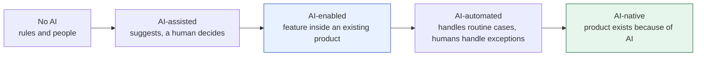

# 6. AI-enabled and AI-native products

Two different ways to build with AI. **AI-enabled** means adding AI features to something that already works without it.
**AI-native** means designing a product around AI from the start, so that without the AI there is no product. Knowing which one
you are building changes your architecture, risk, cost and team.

[← Roadmap](../README.md) · Previous: [5. Algorithms](05-algorithms.md) · Next: [7. Chatbots and assistants](07-chatbots-and-assistants.md) · [8. Agentic AI](08-agentic-ai.md)

**Prerequisites:** [Models](04-models.md) (choosing and calling models); product or software-engineering experience helps more than extra maths.

## The difference

| | **AI-enabled** | **AI-native** |
|--|----------------|---------------|
| Definition | An existing product or process gets AI features | The product is built around AI as its core |
| Test | *Remove the AI and it still works*, only worse or slower | *Remove the AI and nothing is left* |
| Typical changes | Smarter search, auto-fill, summaries, classification, drafting help, a chat helper | A different interface (natural language, agents), new workflows, new business model |
| Architecture | Existing system plus an AI service behind a clear interface; fallbacks to the old way | AI is the core loop; data, evaluation and feedback are first-class; humans supervise |
| Risk | Lower: wrong AI output is a degraded feature | Higher: wrong AI output *is* the product failing |
| Time to value | Weeks | Months, with more uncertainty |
| Team | Existing engineers plus an AI engineer | Product, engineering, evaluation and data together from day one |
| Success measure | Time saved, cost reduced, conversion improved | Whether users get a result they would not get otherwise |

It is a spectrum, not a switch. Most businesses should start at the left and move right only where it pays.

## Examples

| Idea | AI-enabled version | AI-native version |
|------|--------------------|-------------------|
| Customer support | Add a "suggest a reply" button for agents | An assistant resolves most tickets itself, humans handle escalations |
| Customer feedback | Keep the manual process; use AI to parse messy customer details and draft messages (as in the `ai-enabled-bu-app` design) | A system that talks to customers, learns what drives reviews and runs the whole campaign |
| Documents | OCR plus search over scans (see `pdf-ocr-extractor`) | An assistant that reads every document, answers questions and files actions |
| Software development | Autocomplete in the editor | Agents that take a ticket to a reviewed change |
| Search | Better ranking with embeddings | Answer engines that compose answers with sources |
| Healthcare admin | Pull codes from clinical notes (see `nlp-uima-medical-demo`) | Ambient documentation that writes the note and fills the record, with clinician sign-off |

## Common AI feature patterns

| Pattern | What it does | Typical technique |
|---------|--------------|-------------------|
| Classify and route | Label tickets, emails, documents | Small model or prompt with fixed labels |
| Extract | Turn messy text/images into fields | LLM with structured output; OCR; rules where possible |
| Summarise and draft | Shorten or write first drafts | LLM with human review |
| Search and answer | Find and explain information | Embeddings plus RAG ([7](07-chatbots-and-assistants.md)) |
| Recommend | Suggest the next item or action | Collaborative filtering, ranking models |
| Predict | Forecast demand, churn, risk | Classic ML ([1](01-machine-learning.md)) |
| Converse | Natural-language interface | Chatbot or assistant ([7](07-chatbots-and-assistants.md)) |
| Act | Carry out multi-step tasks with tools | Agents ([8](08-agentic-ai.md)) |
| Generate media | Images, video, audio | [9](09-video-and-generative-media.md) |

## Designing an AI feature: questions to answer first

| Question | Why |
|----------|-----|
| What decision or task improves, and by how much, measured how? | No metric, no way to know it works |
| What is the **cost of a wrong answer**? | Decides how much human review and guarding you need |
| Is AI needed at all, or would a rule, query or form do? | Rules are cheaper, exact and explainable |
| Where is the human in the loop (review, approve, override)? | The main safety and quality lever |
| What happens when the AI is down, slow or wrong (fallback)? | AI-enabled features must degrade gracefully |
| What data goes to the model, and are we allowed to send it? | Privacy, contracts and law; see [12](12-responsible-ai-and-security.md) |
| What will it cost at 10× the volume? | Model calls are a variable cost |
| How will we **evaluate** it before and after launch? | Fixed test set, monitoring, user feedback |
| Can we switch the model or vendor later? | Keep an abstraction; models change fast |

## Build, buy or configure

| Option | When |
|--------|------|
| **Configure** an existing AI product (assistant, helpdesk AI, OCR service) | The need is common and speed matters |
| **Build on APIs** (your own thin layer over a model) | The need is specific to your data or workflow |
| **Train or fine-tune your own** | Unique data, scale, privacy or cost reasons, and you can maintain it |

Start with the cheapest option that meets the need; move down only with evidence.

## AI-native product characteristics

- A **natural-language or goal-based interface** instead of forms and menus.
- **Agents as workers** under human supervision; see [8](08-agentic-ai.md).
- **Evaluation built in:** automated tests of AI behaviour on every release, plus live monitoring.
- A **data flywheel:** usage produces feedback and data that improve the product, within privacy limits.
- **Probabilistic UX:** the interface shows confidence, sources and easy correction, because answers are sometimes wrong.
- **Cost as a design constraint:** every user action has a model cost.

## Topics in learning order

| # | Topic | Check yourself |
|---|-------|----------------|
| 1 | Spotting AI opportunities and saying no to bad ones | You can list a business process and mark which steps need AI |
| 2 | Defining success metrics and the cost of errors | You wrote a one-page spec with metric, risk and fallback |
| 3 | Human-in-the-loop design | You designed a review screen and an override path |
| 4 | Architecture for AI features: a service boundary, fallbacks, timeouts, caching, async jobs | You added an AI feature behind an interface that can be switched off |
| 5 | Evaluation and monitoring | You have a regression test set for your AI feature |
| 6 | Cost modelling | You can forecast monthly model cost from usage |
| 7 | UX for uncertain output | Users can see sources and correct mistakes |
| 8 | Legal, privacy and trust basics | You can say what data you send and why that is allowed |

## Projects

| Level | Project |
|-------|---------|
| Starter | Take a process you know and write an "AI opportunity map": steps, AI or not, risk, metric |
| Intermediate | Add one AI feature (extract fields from emails, or a draft reply) to a small existing app, with human review and a fallback |
| Stretch | Design an AI-native version of the same product on paper: interface, agents, evaluation, costs, risks; compare it honestly with the enabled version |

## Done when

- You can classify a product idea as AI-enabled or AI-native and justify the design differences.
- You can write a spec for an AI feature including metric, cost of error, human-in-the-loop, fallback and evaluation.
- You can estimate cost and decide build vs buy.

## Common mistakes

- **Starting with the technology** ("let's add a chatbot") instead of a problem.
- **No fallback** when the model is down or wrong.
- **Treating a demo as a product:** the last 20% (evaluation, edge cases, cost, security) is most of the work.
- **No measurement of the business result**, only of model quality.
- **Calling an AI-enabled feature AI-native** to sound modern, then under-investing in what a truly native product needs.
