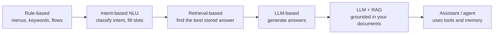
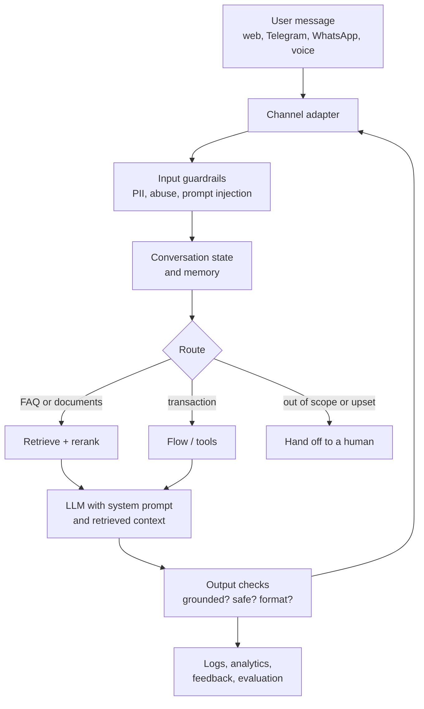
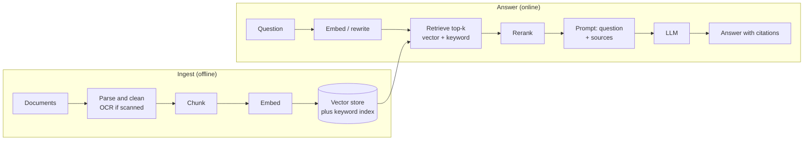

# 7. Chatbots and AI assistants

A **chatbot** holds a conversation to answer questions or complete a narrow task. An **AI assistant** goes further: it knows
about you or your business, remembers, and takes actions on your behalf. This branch covers both, from the rule-based bots that
still run most customer service to retrieval-based LLM assistants.

[← Roadmap](../README.md) · Previous: [6. AI-enabled and AI-native](06-ai-enabled-and-ai-native.md) · Next: [8. Agentic AI](08-agentic-ai.md)

**Prerequisites:** [Models](04-models.md) (calling an LLM, prompts, embeddings); basic web/API skills.

## Chatbot, assistant, agent

| | Chatbot | AI assistant | Agent ([8](08-agentic-ai.md)) |
|--|---------|--------------|-------------------------------|
| Goal | Answer or guide within a narrow scope | Help a person with many tasks, with context | Pursue a goal autonomously over many steps |
| Memory | Current conversation | Conversation, preferences, documents, history | Task state, plans, long-term memory |
| Actions | Few or none | Some tools (search, calendar, tickets) with approval | Many tools, plans and loops |
| Control | Scripted or tightly prompted | Prompted, user in the loop | Guardrails, budgets, approvals |
| Example | FAQ bot on a website | Workplace assistant that searches your documents and drafts replies | Agent that investigates an incident and opens a fix |

## Kinds of chatbot

| Kind | Strength | Weakness | Use when |
|------|----------|----------|----------|
| Rule / flow-based | Predictable, cheap, auditable | Rigid | Short, fixed processes (booking, collecting details) |
| Intent and slot-filling (for example Rasa, Dialogflow-style tools) | Reliable for known tasks | Needs training data per intent | Banking-style, regulated tasks |
| **LLM + RAG** | Flexible, answers from your content | Can still hallucinate; needs evaluation | Support, knowledge assistants |
| Hybrid | Flows where precision matters, LLM where flexibility helps | More to build | Most production bots |

A good production bot is often **mostly a flow with an LLM in a few places**, not a free-form LLM.

## Anatomy of an LLM chatbot

## Retrieval-augmented generation (RAG)

RAG gives the model **your facts at question time** instead of hoping it memorised them.

| RAG decision | Guidance |
|--------------|----------|
| Chunk size | Follow document structure (sections, headings); add overlap; test sizes on your data |
| Retrieval | **Hybrid** (vector plus keyword/BM25) usually beats vector alone; add reranking |
| Prompt | Tell the model to answer *only* from the sources and to say "I don't know" otherwise; return citations |
| Freshness | Re-index when documents change; store source and date |
| Permissions | Retrieve only what this user may see; enforce access control at retrieval, not in the prompt |
| Evaluate | Retrieval (did the right chunk come back?) and generation (faithful to sources? relevant?) **separately** |

## Voice and multimodal assistants

Voice = **speech-to-text → LLM → text-to-speech**, or a single speech-to-speech model. Extra topics: latency (under about one second
feels natural), interruption handling, noise, accents, and consent for recording. Multimodal assistants also accept images and
documents (read a screenshot, an invoice, a chart).

## Assistant memory

| Memory type | Holds | How |
|-------------|-------|-----|
| Short-term | The current conversation | Recent messages in the prompt; summarise when long |
| Long-term | Preferences, facts about the user | Stored notes retrieved when relevant; let users see and delete them |
| Knowledge | Company documents | RAG |

Memory is personal data: show it, let users correct and delete it, and keep it per user.

## Topics in learning order

| # | Topic | Check yourself |
|---|-------|----------------|
| 1 | Conversation design: scope, tone, what the bot must refuse, human hand-off | You wrote 20 sample conversations including failures |
| 2 | Rule and flow-based bots; slot filling | You built a bot that collects a booking with validation |
| 3 | Channels: web widget, Telegram, WhatsApp, Slack, voice; webhooks | Your bot answers in a real messaging app |
| 4 | LLM prompting for chat: system prompt, personas, few-shot, structured output | Your bot stays in scope under odd questions |
| 5 | Conversation state and memory | Your bot remembers earlier turns and can forget on request |
| 6 | RAG end to end (ingest, chunk, embed, retrieve, rerank, cite) | Your bot answers from 50 documents and cites them |
| 7 | Guardrails: prompt injection, PII, refusals, topic limits | You tested attacks and wrote down what still gets through |
| 8 | Evaluation: test conversations, groundedness, human review, A/B tests | You can show a number for quality before and after a change |
| 9 | Hand-off to humans, escalation, analytics | A frustrated user reaches a person with context |
| 10 | Voice and multimodal (optional) | A voice demo with measured latency |
| 11 | Cost, latency and caching | You know your cost per conversation |

## Tools

| Tool | Use |
|------|-----|
| Telegram Bot API (free), WhatsApp Business Platform (paid), web chat, Slack | Channels |
| Rasa, Botpress, Dialogflow-style platforms | Intent/flow bots |
| LangChain, LlamaIndex, Haystack, Spring AI, LangChain4j | LLM and RAG frameworks (Python and Java) |
| Vector stores: pgvector, Chroma, Qdrant, Weaviate, Milvus, Elasticsearch/OpenSearch | Retrieval storage |
| Ollama, vLLM | Local models |
| Ragas, promptfoo, custom test sets | Evaluation |
| Langfuse, LangSmith, OpenTelemetry | Tracing and monitoring |

## Projects

| Level | Project |
|-------|---------|
| Starter | A flow-based Telegram bot that collects a name and phone number with validation and confirmation |
| Intermediate | A RAG assistant over your own PDFs (use OCR for scans) with citations and an "I don't know" path; a 50-question test set with scores |
| Stretch | A multi-channel support assistant: hybrid retrieval, permissions, guardrails, human hand-off, tracing and a cost dashboard |

## Done when

- You can build a bot that holds a conversation in a real channel.
- You can build a RAG pipeline, explain each stage, and **measure** its quality.
- You can name the main attacks (prompt injection, data leakage) and your defences.
- You know your cost and latency per conversation.

## Common mistakes

- **A free-form LLM where a short flow would be safer and cheaper.**
- **No "I don't know".** Bots must be able to decline.
- **Putting permissions in the prompt** instead of enforcing them at retrieval and in tools.
- **Judging quality by trying a few questions.** Build a test set.
- **No human hand-off.**
- **Storing conversations forever** without a purpose, consent or retention limit.
