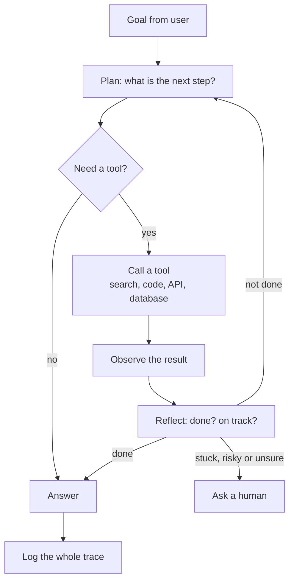

# 8. Agentic AI

An **agent** is an LLM-driven system that **pursues a goal over several steps**: it decides what to do, uses tools (search, code,
databases, other software), looks at the results and continues until it is done or needs help. This branch covers the patterns,
the protocols that connect agents to tools, and, most importantly, how to keep agents safe and testable.

[← Roadmap](../README.md) · Previous: [7. Chatbots and assistants](07-chatbots-and-assistants.md) · Next: [9. Video and generative media](09-video-and-generative-media.md) · [11. MLOps](11-mlops-and-llmops.md)

**Prerequisites:** [Models](04-models.md) (tool/function calling, structured output), [Chatbots and RAG](07-chatbots-and-assistants.md), solid programming, [security basics](12-responsible-ai-and-security.md).

> **Fast-moving.** Frameworks and protocols evolve quickly (snapshot October 2026). The patterns below are stable; check current
> framework docs before choosing one.

## The agent loop

An LLM call inside a loop, with tools, state and stopping rules: that is nearly all an agent is.

## Workflows vs agents: start simple

| | **Workflow** | **Agent** |
|--|--------------|-----------|
| Who decides the steps? | **You**, in code | The model, at run time |
| Predictability | High | Lower |
| Cost and latency | Lower, fixed | Higher, variable |
| Use when | The steps are known (extract → classify → draft → review) | The steps cannot be known in advance (open-ended research, debugging) |

**Rule of thumb:** use a single well-prompted call first; add retrieval and tools; use a fixed workflow when steps are known; use a
true agent only when the problem needs flexible decisions and you can afford the cost and testing. Many "agents" in production are
workflows with one or two decision points.

## Patterns

| Pattern | What it does | Use when |
|---------|--------------|----------|
| **Prompt chaining** | Fixed sequence of calls, each feeding the next | Steps are known |
| **Routing** | Classify the input, send it to the right handler or model | Different request types |
| **Parallelisation** | Run independent sub-tasks together, or the same task several times and vote | Speed, or confidence |
| **Orchestrator-workers** | A lead model splits the task and delegates to workers | Tasks whose parts are not known in advance |
| **Evaluator-optimiser (reflection)** | One call produces, another critiques, loop | Quality improves with feedback (writing, code) |
| **ReAct** | Alternate reasoning and tool use | General tool-using agents |
| **Plan-and-execute** | Plan first, then run the steps, replan on failure | Longer tasks |
| **Multi-agent** (handoffs, supervisor, debate) | Specialised agents cooperating | Truly separable roles; adds cost and failure modes, so justify it |
| **Human-in-the-loop** | Pause for approval at risky steps | Anything irreversible |

## Building blocks

| Block | What it is | Notes |
|-------|-----------|-------|
| **Tools / function calling** | You describe functions; the model asks to call them with arguments | Clear names, descriptions and typed parameters matter more than clever prompts |
| **Structured output** | Model returns JSON that matches a schema | Validate it; never trust it |
| **Memory** | Short-term (the trace), long-term (stored notes), knowledge (RAG) | See [7](07-chatbots-and-assistants.md) |
| **Planning** | Breaking a goal into steps | Sometimes a stronger or "reasoning" model plans while cheaper ones execute |
| **State and checkpoints** | Saving progress so a run can resume or be inspected | Needed for long tasks and approvals |
| **Computer and browser use** | Agents operating GUIs and web pages | Powerful but fragile and a major attack surface |
| **Code execution** | Running generated code | Only in a **sandbox** |

## Protocols: connecting agents to tools and each other

| Protocol | Purpose | Notes |
|----------|---------|-------|
| **MCP (Model Context Protocol)** | A standard way to connect an AI application to tools, data and prompts through MCP servers | Introduced by Anthropic in November 2024; widely adopted and later moved to a Linux Foundation project (the Agentic AI Foundation) |
| **A2A (Agent2Agent)** | A standard for one agent to discover and delegate tasks to another, using "agent cards" and task lifecycles | Announced by Google in April 2025 with many partners |
| Others (AG-UI, A2UI, AP2 and more) | Agent-to-interface and payments protocols | Emerging; treat as optional until you need them |

Most teams today use MCP for tools and consider A2A only when agents from different systems must cooperate. Sources are listed at the end.

## Frameworks (examples; verify current status)

| Language | Examples |
|----------|----------|
| Python | LangGraph, LlamaIndex, CrewAI, AutoGen, OpenAI Agents SDK, Claude Agent SDK, Google ADK, PydanticAI |
| Java / JVM | **Spring AI**, LangChain4j, Semantic Kernel (also .NET) |
| TypeScript | Vercel AI SDK, Mastra, LangGraph.js |

Frameworks save boilerplate but can hide what is sent to the model. Learn the raw loop (about 100 lines) first; adopt a framework
for state, tracing and tooling once you know what it does for you.

## Safety: the part that matters most

An agent that can act can also act wrongly. Design for it:

| Risk | Defence |
|------|---------|
| **Prompt injection** (instructions hidden in a web page, email or document that the agent reads) | Treat all retrieved content as *data*, never as instructions; separate privileges; confirm sensitive actions |
| **Excessive permissions** | Least privilege: each tool gets only the access it needs; read-only by default |
| **Irreversible actions** (sending, paying, deleting) | Human approval; dry-run mode; undo where possible |
| **Runaway loops and cost** | Step limit, time limit, token budget, per-run cost cap |
| **Data leakage** | Redact PII; restrict which tools can send data out; log egress |
| **Untrusted code** | Sandbox with no network or credentials |
| **Compounding errors** | Checkpoints, verification steps, evaluate intermediate results |
| **Unclear accountability** | Full audit trail: who asked, what the agent saw, what it did |

The "lethal trifecta" to remember: an agent with **access to private data**, **exposure to untrusted content** and **the ability to
send data outward** can be tricked into leaking. Remove at least one of the three.

## Testing and observing agents

| Practice | Why |
|----------|-----|
| **Tracing** every step (prompt, tool call, result, cost) | Without it you cannot debug a non-deterministic system |
| **Task-level evaluations** with scripted scenarios and success criteria | Measures the outcome, not just single answers |
| **Trajectory checks** (did it take a safe, efficient path?) | An agent can reach the right answer in a dangerous way |
| Regression suite run on every prompt/model/tool change | Changes break agents in surprising ways |
| Red-teaming for injection and misuse | Find problems before users do |
| Cost and latency budgets | Agents can silently become expensive |

## Topics in learning order

| # | Topic | Check yourself |
|---|-------|----------------|
| 1 | Tool / function calling | You built a model that calls two of your functions correctly |
| 2 | The raw agent loop with limits | You wrote a ReAct-style loop with a step and budget cap |
| 3 | Workflow patterns (chain, route, parallel, orchestrator-workers, evaluator) | You can pick the simplest pattern for a task |
| 4 | Structured output and validation | Bad model output never crashes or harms your system |
| 5 | Memory and state; checkpoints | A run can be paused, resumed and inspected |
| 6 | MCP: using and building a server | You exposed one of your services as MCP tools |
| 7 | Human-in-the-loop and permissions | Risky tools need approval and every action is logged |
| 8 | Prompt injection and agent security | You attacked your own agent and fixed what you found |
| 9 | Evaluation and tracing for agents | You can show success rate, cost and a trace for a failed run |
| 10 | Multi-agent systems (when justified) | You can argue why one agent was not enough |
| 11 | Computer/browser use and coding agents (advanced) | You ran one in a sandbox with strict limits |
| 12 | Productionising: queues, retries, timeouts, cost control | See [11](11-mlops-and-llmops.md) |

## Projects

| Level | Project |
|-------|---------|
| Starter | A tool-using assistant with three tools (calculator, search over your notes, a read-only database query), step-limited and fully traced |
| Intermediate | A research agent: given a question, searches sources, extracts evidence, writes a cited report; evaluated on 20 questions; injection tested |
| Stretch | An agent that triages incidents or support tickets with an orchestrator and specialist workers, human approval for any action, sandboxed code execution, cost caps and a regression suite |

## Done when

- You can build the agent loop yourself and explain every part.
- You know when *not* to use an agent.
- You can name five agent failure modes and the control for each.
- Your agents are traced, evaluated and limited by budgets and permissions.

## Common mistakes

- **Reaching for multi-agent frameworks first.** Most problems need one call or one workflow.
- **Giving agents broad permissions** "to make it work".
- **No step, time or cost limits.**
- **Believing tool output is trustworthy.** Treat it as untrusted input.
- **Evaluating by demo.** Build scenario tests and run them on every change.
- **Not logging traces**, then being unable to explain a failure.

## Sources for the protocol notes

- [Agent interoperability protocols: MCP, A2A and others (Atlan)](https://atlan.com/know/agent-interoperability-protocols/)
- [A2A protocol explained (OneReach)](https://onereach.ai/blog/what-is-a2a-agent-to-agent-protocol/)
- [The state of agentic AI standards in 2026 (DEV Community)](https://dev.to/alexmercedcoder/the-state-of-agentic-ai-standards-in-2026-mcp-a2a-webmcp-osi-and-the-protocol-stack-taking-3o2l)
- Official: [Model Context Protocol](https://modelcontextprotocol.io) and Anthropic's engineering article *Building effective agents* (the workflow-vs-agent guidance above follows it).
