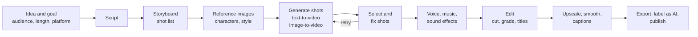

# 9. Video creation and generative media

Generating and editing **video, images, audio and voice** with AI. This is the most tool-driven branch and changes fastest:
products appear and disappear within months. Learn the *pipeline and the concepts*; treat any named tool as an example.

[← Roadmap](../README.md) · Previous: [8. Agentic AI](08-agentic-ai.md) · Next: [10. Research](10-research.md)

**Prerequisites:** none to *use* the tools; for the technical track, [deep learning](03-deep-learning.md) (diffusion) and Python. Basic
video literacy (shots, framing, editing) helps more than any model knowledge.

> **Snapshot: October 2026, and the least stable page in this repository.** Reports in 2026 describe several strong commercial
> video models (for example Google's Veo, Kuaishou's Kling and Runway's models), open-weight options (for example Wan and LTX),
> native audio generated together with the picture becoming common, and at least one prominent product being discontinued.
> These are single-source, fast-changing statements: **check current reviews and each tool's own site before choosing**.
> Sources at the end.

## Two tracks

| Track | For | You learn |
|-------|-----|-----------|
| **Creator / producer** | Marketing, education, social, storytelling | Scripting, prompting, shot design, editing, sound, rights; commercial tools |
| **Technical / builder** | Developers, researchers, tool-makers | Diffusion models, video architectures, ComfyUI-style pipelines, open models, fine-tuning, serving, automation |

## The production pipeline

Typical rule: generate **many short shots** (a few seconds each) and **edit them together**, rather than hoping for one perfect long clip.

## Generation modes

| Mode | Input → output | Use |
|------|----------------|-----|
| **Text-to-video** | Prompt → clip | Ideas, B-roll, concepts |
| **Image-to-video** | Image (plus prompt) → clip | Control the look; animate a design or photo; keep a character consistent |
| **Video-to-video** | Clip (plus prompt) → changed clip | Restyle, change lighting or objects |
| **First/last-frame, reference-based** | Frames or reference images → clip | Consistency and continuity between shots |
| **Lip-sync / avatar** | Face or character plus audio → talking video | Presenters, dubbing (see consent below) |
| **Text-to-image** | Prompt → image | Storyboards, thumbnails, assets |
| **Text-to-speech, voice cloning** | Text → voice | Narration; clone only with permission |
| **Music and sound** | Prompt → audio | Backing tracks and effects |

## Core concepts

| Concept | In one line |
|---------|-------------|
| **Diffusion** | The model learns to remove noise step by step; generation starts from noise and denoises towards the prompt |
| **Latent space** | Models work on a compressed version of the frames, which makes video affordable |
| **Temporal consistency** | Keeping objects, faces and lighting stable across frames; the hard part of video |
| **Prompting for video** | Describe subject, action, camera move (pan, dolly, handheld), lens/framing, lighting, style, mood, duration |
| **Seed** | The random starting point; reuse it to reproduce or vary a result |
| **Conditioning** | Extra inputs that steer generation: reference images, depth, pose, edges, audio |
| **Resolution, frame rate, duration** | Drive cost and quality; most tools generate short clips (seconds) per request |
| **Cost** | Usually credits per second of video; iterations are the real cost, so plan shots before generating |

## Tool categories (examples, verify current)

| Category | Examples | Notes |
|----------|----------|-------|
| Commercial video generators | Veo, Kling, Runway, Luma, Pika, MiniMax Hailuo, Seedance | Highest convenience; credits or subscription; terms and commercial-use rights differ |
| Open-weight video models | Wan, LTX, HunyuanVideo, others | Run locally or on rented GPUs; need hardware and skill; fine-tunable |
| Node-based pipelines | **ComfyUI** | Chain models, images, control and upscaling into reusable workflows |
| Image generators | Several commercial services; Stable Diffusion/FLUX-family open models | Storyboards and references |
| Voice and music | ElevenLabs-style TTS services, open TTS models, music generators | Check voice and licence terms |
| Editing | **DaVinci Resolve** (free version), CapCut, Premiere Pro, Final Cut | Where the finished piece is assembled |
| Automation | **FFmpeg**, Python (MoviePy), Remotion (code-driven video in React) | Batch edits, captions, templates, programmatic videos |
| 3D / VFX | Blender (free) | Mixing generated and conventional footage |

## Rights, ethics and platform rules

| Issue | What to do |
|-------|------------|
| **Likeness and consent** | Never generate or clone a real person's face or voice without permission; deepfake misuse is illegal in many places |
| **Copyright and training data** | Law is unsettled and differs by country; read each tool's terms on commercial use and indemnity; avoid prompting for existing characters or styles of living artists |
| **Disclosure and labelling** | Platforms increasingly require labelling AI-generated or altered content; keep provenance such as **C2PA / Content Credentials** where supported |
| **Misleading content** | No fake news footage, fake testimonials or fake endorsements; for reviews, see Google's rules on fake reviews and incentives |
| **Safety filters** | Tools block some content; do not try to evade them |
| **Brand and accuracy** | AI video can mis-render text, hands, products and physics: check every frame before publishing |

## Topics in learning order

| # | Topic | Check yourself |
|---|-------|----------------|
| 1 | Video basics: shot types, framing, pacing, aspect ratios, story structure | You can write a 6-shot storyboard for a 30-second piece |
| 2 | Writing scripts and shot prompts | A prompt names subject, action, camera, light and mood |
| 3 | Text-to-image for references and storyboards | You can keep one character consistent across 5 images |
| 4 | Image-to-video and text-to-video generation | You produced and compared clips from 2 tools or models |
| 5 | Voice, music and sound design | Your clip has clear narration at a good level and no clashing music |
| 6 | Editing and finishing: cuts, transitions, grading, captions | A viewer can follow the video with the sound off |
| 7 | Consistency techniques: reference frames, seeds, shot design | A 5-shot sequence reads as one scene |
| 8 | Rights, disclosure and provenance | You have a checklist you apply before publishing |
| 9 | **Technical track:** how diffusion and video models work | You can explain denoising and latent space without notes |
| 10 | **Technical track:** run open models and ComfyUI workflows | You built and saved a reusable workflow on a GPU |
| 11 | **Technical track:** automate with FFmpeg / Python and call generation APIs | A script turns a text list into a captioned video |
| 12 | Cost planning | You budget shots, retries and credits before starting |

## Projects

| Level | Project |
|-------|---------|
| Starter | A 30-second explainer: script, storyboard, 5 generated shots, narration, captions; disclose it as AI-assisted |
| Intermediate | A reusable template: same character and style across 3 episodes with a consistent look and voice |
| Stretch (technical) | An automated pipeline: text brief → script → shots (open model or API) → voice → FFmpeg assembly → captions, with a cost log and a human approval step before publishing |

## Done when

- You can take an idea to a finished, captioned video using AI tools, in a repeatable process.
- You can explain what diffusion models do and why video consistency is hard.
- You apply a rights and disclosure checklist every time.
- You can estimate the cost of a video before generating it.

## Common mistakes

- **Generating before planning:** a storyboard saves more credits than any prompt trick.
- **One long clip** instead of short shots edited together.
- **Ignoring sound:** audio makes or breaks perceived quality.
- **Not checking frames** for garbled text, extra fingers or product errors.
- **Cloning voices or faces without consent**, or copying a protected character.
- **Committing to one tool** in a market that changes every quarter. Keep prompts, references and scripts in your own files.

## Sources for the snapshot

- [AI video generation in 2026 (ocdevel)](https://ocdevel.com/mlg/mla-26)
- [Best video generation AI models in 2026 (Pinggy)](https://pinggy.io/blog/best_video_generation_ai_models/)
- [Text-to-video model (Wikipedia)](https://en.wikipedia.org/wiki/Text-to-video_model)
- These are secondary sources and some claims appear in a single source; verify with each vendor.
