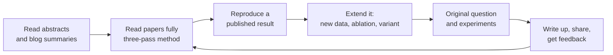
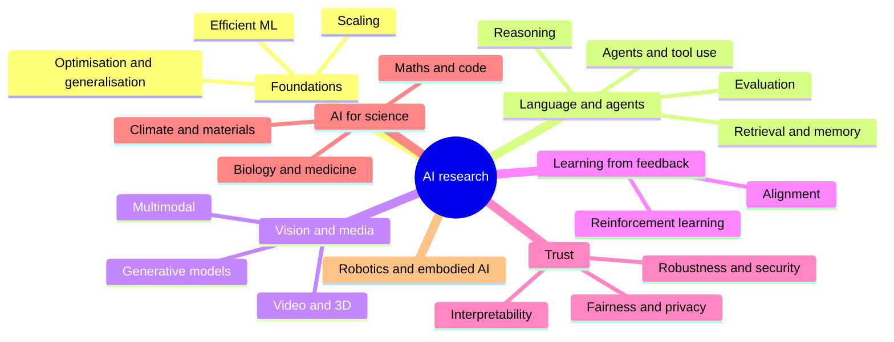

# 10. Research

How to find out what is true and new in AI: reading papers, reproducing results, designing fair experiments, and (if you want) doing
original work. It is useful even if you never publish, because it is the skill of not being fooled by hype, including your own.

[← Roadmap](../README.md) · Previous: [9. Video and generative media](09-video-and-generative-media.md) · Next: [11. MLOps and LLMOps](11-mlops-and-llmops.md)

**Prerequisites:** [Machine learning](01-machine-learning.md) and [deep learning](03-deep-learning.md); statistics for experiments;
comfort reading maths. You can start reading papers early, with the [glossary](../glossary/keywords.md) open.

## Two meanings of "research"

| Meaning | For | Output |
|---------|-----|--------|
| **Staying informed and evaluating claims** | Every practitioner | You can tell whether a result applies to your problem |
| **Doing original research** | Researchers, research engineers, graduate students | New methods, analyses, benchmarks or findings |

## The research ladder

Most people get large value from steps A to C. Do not skip C: reproducing a result teaches more than reading ten papers.

## Reading a paper in three passes

| Pass | Time | Goal |
|------|------|------|
| 1: survey | 5 to 10 min | Title, abstract, figures, conclusion: what problem, what claim, is it relevant? |
| 2: understand | about 1 hour | Read the method and results; note terms to look up; skip proofs |
| 3: critique | 2+ hours | Re-derive or re-implement key parts; question every assumption |

Questions to ask of any paper:

1. What exactly is claimed, and against what baseline?
2. Is the baseline **strong and tuned** as carefully as the new method?
3. Which datasets? Could the test data have leaked into training?
4. How many runs and seeds; are there error bars or only a single number?
5. What do the **ablations** show: which part actually matters?
6. Where does it fail, and do the authors say so?
7. Is code, data and a recipe available? Could someone reproduce it?
8. What is the cost (compute, data, latency) of the improvement?

## Where to find research

| Source | Use |
|--------|-----|
| **arXiv** (cs.LG, cs.CL, cs.CV, cs.AI) | Preprints, usually first and not peer-reviewed |
| Conferences: NeurIPS, ICML, ICLR (general ML); ACL, EMNLP (language); CVPR, ICCV (vision); AAAI | Peer-reviewed work; proceedings and talks are free online |
| **OpenReview** | Reviews and discussion of submissions |
| **Hugging Face Papers** and model cards | Trending papers with linked models and code |
| Semantic Scholar, Google Scholar, Connected Papers | Search, citations and related work |
| Lab blogs and technical reports | Frontier models are often described in reports rather than papers; read them critically, since they can omit details |
| Newsletters and reading groups | Filter the flood; a weekly group beats solitary reading |

## Designing experiments

| Principle | Practice |
|-----------|----------|
| One question at a time | Change one thing; keep everything else fixed |
| Strong baselines | Compare to the best simple method, tuned fairly |
| Fixed, held-out evaluation | Decide the test set and metric **before** you see results |
| Repeat | Several seeds; report mean and spread, not the best run |
| Ablate | Remove each component to see if it matters |
| Beware contamination | Check that evaluation data was not in the training data |
| Track everything | Code version, data version, config, seed, results |
| Report negatives | "It did not work, and here is why" is a result |

## Research areas (a map to choose from)

Pick **one** area, read 5 to 10 recent papers and one survey, list the open questions, and choose a small, testable one.

## Compute and tools for research

| Resource | Notes |
|----------|-------|
| Google Colab, Kaggle | Free GPU hours, limited |
| University clusters, research credits from cloud providers | Often available on application |
| Rented cloud GPUs | Pay by the hour; monitor spend |
| Small-scale first | Prove ideas on small models and data before scaling |
| Weights & Biases, MLflow, DVC, Git | Experiment and data tracking |
| LaTeX/Overleaf, Zotero | Writing and references |

## Topics in learning order

| # | Topic | Check yourself |
|---|-------|----------------|
| 1 | Reading the abstract and figures of a paper and summarising it in 3 sentences | A friend understands your summary |
| 2 | The three-pass method | You fully understood one paper, including its limits |
| 3 | Reproducing a result (small paper or classic) | Your numbers match the paper within noise, or you can explain the gap |
| 4 | Experiment design: baselines, ablations, seeds, statistics | You wrote an experiment plan before running anything |
| 5 | Reading maths in papers | You can derive one equation yourself |
| 6 | Survey a subfield | You wrote a one-page map of an area with open problems |
| 7 | Propose and test a small idea | You have a result, positive or negative, with error bars |
| 8 | Scientific writing and sharing | Your write-up or blog post lets another person reproduce it |
| 9 | Research ethics and honesty | You reported what did not work and disclosed your data and compute |

## Projects

| Level | Project |
|-------|---------|
| Starter | Summarise 5 recent papers in your area in a standard one-page format (problem, method, result, caveat); present them to a peer group |
| Intermediate | Reproduce a published small-scale result and write what matched and what did not |
| Stretch | Ablation or extension study of a published method with several seeds and a short paper-style report (or blog post) with code |

## Done when

- You can read a paper and say what it really shows and what it does not.
- You have reproduced at least one result.
- You can plan an experiment that would convince a sceptic.
- You can keep up with a subfield using a sustainable routine.

## Common mistakes

- **Reading without doing.** Reproduce.
- **Believing headline numbers.** Check baselines, seeds and leakage.
- **Hunting for novelty** before you can reproduce something known.
- **Changing many things at once**, so nothing is learned.
- **Not recording experiments**, and being unable to repeat your own best result.
- **Overclaiming** from one run on one dataset.
