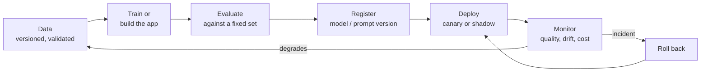

# 11. MLOps and LLMOps

Getting AI out of a notebook and **keeping it working**. MLOps covers classic models; LLMOps covers applications built on language
models. The technology differs a little; the discipline is the same: version everything, test automatically, deploy safely, monitor,
and be able to roll back.

[← Roadmap](../README.md) · Previous: [10. Research](10-research.md) · Next: [12. Responsible AI and security](12-responsible-ai-and-security.md)

**Prerequisites:** Python, Git, basic web/API and Docker knowledge; at least one model or LLM app to operate ([1](01-machine-learning.md), [4](04-models.md), [7](07-chatbots-and-assistants.md) or [8](08-agentic-ai.md)).

## The lifecycle

## MLOps vs LLMOps

| | Classic MLOps | LLMOps |
|--|---------------|--------|
| What you version | Data, features, code, trained model | Prompts, retrieval config, model/provider choice, tools, evaluation sets |
| What you train | Often yourself | Usually nothing; you configure and orchestrate |
| Evaluate with | Held-out data and metrics | Evaluation sets, rubrics, LLM-as-judge plus human review |
| What drifts | Input data distribution | Provider model updates, user behaviour, documents changing |
| Main cost | Training compute | Per-token inference cost |
| Main risk | Silent accuracy decay | Hallucination, injection, cost blow-ups, provider changes |
| Observability | Metrics and drift | **Traces** of each call (prompt, retrieved context, tool calls, output) |

## Topics in learning order

| # | Topic | What to learn | Check yourself |
|---|-------|---------------|----------------|
| 1 | Reproducibility | Git, pinned dependencies, seeds, config files, environments | Someone else gets your result from your repo |
| 2 | Data and model versioning | DVC, lakeFS or similar; dataset hashes; model registries | You can say which data trained which model |
| 3 | Experiment tracking | MLflow, Weights & Biases | You can compare 20 runs and pick one on evidence |
| 4 | Pipelines | Orchestrators (Airflow, Dagster, Prefect, Kubeflow); idempotent steps; scheduling | A failed step can be re-run without side effects |
| 5 | Packaging and serving | REST/gRPC with FastAPI or similar; Docker; batch vs real-time; model servers (vLLM, Triton, TorchServe, KServe) | Your model answers requests in a container |
| 6 | CI/CD for ML | Tests for code **and** data and models; automated evaluation gate; staged rollout (shadow, canary) | A bad model cannot reach production automatically |
| 7 | Monitoring and drift | Latency, errors, input and prediction drift, delayed labels, alerts | You get an alert before users complain |
| 8 | **LLM tracing and evaluation** | OpenTelemetry/Langfuse/LangSmith-style traces; regression sets; online feedback; cost per request | You can replay a bad conversation and see what the model saw |
| 9 | Cost and performance engineering | Caching, batching, model routing, quantisation, autoscaling, quotas | You can state cost per 1,000 requests and cut it |
| 10 | Reliability | Timeouts, retries with back-off, circuit breakers, fallbacks, idempotency, rate limits | The system degrades gracefully when the model provider is down |
| 11 | Infrastructure basics | Linux, networking, cloud (VMs, storage, IAM), Kubernetes (intro), infrastructure as code | You can deploy with one command and tear it down |
| 12 | Governance | Model cards, audit logs, approvals, retention, access control | You can show who changed what and when |

## Tools (examples; verify current status)

| Need | Tools |
|------|-------|
| Versioning | Git, DVC, lakeFS |
| Tracking and registry | MLflow, Weights & Biases |
| Pipelines | Airflow, Dagster, Prefect, Kubeflow |
| Serving | FastAPI, BentoML, KServe, Triton, vLLM |
| Containers and platforms | Docker, Kubernetes, managed cloud ML platforms |
| LLM observability and evaluation | Langfuse, LangSmith, OpenTelemetry, promptfoo, Ragas |
| Monitoring | Prometheus, Grafana, Evidently |
| Feature stores | Feast and cloud equivalents |
| Infrastructure as code | Terraform, Pulumi |

## Projects

| Level | Project |
|-------|---------|
| Starter | Containerise a model behind an API, with a test, a health check and a README that lets a stranger run it |
| Intermediate | Add experiment tracking and an automated evaluation gate in CI that blocks a model (or prompt) worse than the current one |
| Stretch | An LLM application with tracing, a regression suite, cost dashboards, a fallback provider and a canary rollout for prompt changes |

## Done when

- You can ship a model or LLM app as a service others can run, with tests and monitoring.
- You can say, for any production version, exactly what data/prompt/model produced it.
- A change cannot reach users without passing automated evaluation.
- You know the cost per request and have a rollback plan.

## Common mistakes

- **Notebooks as production.**
- **No evaluation gate**: changes ship on feel.
- **No monitoring after launch:** quality decays quietly.
- **Not versioning prompts**, then being unable to say what changed.
- **No timeouts or fallbacks** for external model APIs.
- **Logging full conversations with personal data** without a retention policy; see [12](12-responsible-ai-and-security.md).
