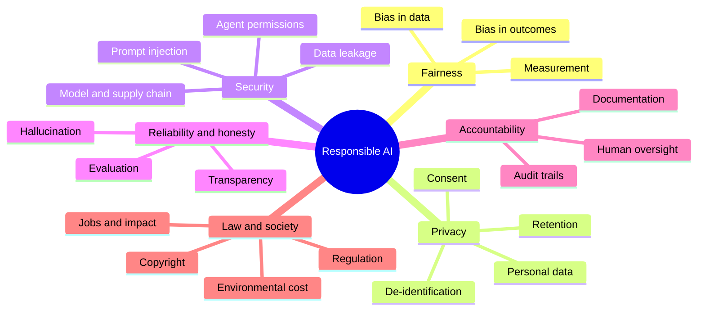

# 12. Responsible AI and security

Making AI systems **fair, private, safe, secure and accountable**. Learn this *alongside* every other branch, not after: the
expensive failures in AI products are usually here, not in the model's accuracy.

[← Roadmap](../README.md) · Previous: [11. MLOps and LLMOps](11-mlops-and-llmops.md) · Back to the [start](../README.md)

**Prerequisites:** none to begin; it makes most sense once you have built a small model or LLM app ([1](01-machine-learning.md), [7](07-chatbots-and-assistants.md)).

> This page is educational, not legal advice. Laws differ by country and change; ask a qualified professional about your case.

## The areas

## Fairness and bias

| Concept | Meaning | Practice |
|---------|---------|----------|
| Bias in data | Training data under-represents or mislabels groups, or reflects past unfairness | Examine who is in the data and who is missing; document it |
| Bias in outcomes | Error rates or decisions differ across groups | Measure metrics **per group** (not only overall) |
| Proxies | A harmless-looking feature that stands in for a protected one (postcode for ethnicity) | Check correlations; remove or control for proxies |
| Fairness definitions | Equal error rates, equal opportunity, calibration; they cannot all hold at once | Choose with the affected people and the context, and document the trade-off |
| Feedback loops | Model decisions change the data it later learns from | Monitor over time |

## Privacy

| Topic | Practice |
|-------|----------|
| **Personal data** (names, phones, emails, health, location, anything identifying) | Know what you hold; collect the minimum; state the purpose |
| Consent and lawful basis | Record consent, honour opt-out; messaging channels such as WhatsApp require opt-in |
| Sending data to a model provider | Read the provider's terms on retention and training use; use contracts and settings that fit your data; redact where possible |
| Retention and deletion | Keep only as long as needed; support deletion requests |
| De-identification | Hard to do perfectly; names are easy, but combinations of facts can identify people |
| Regulation (examples) | GDPR (EU), India's DPDP Act, HIPAA (US health), sector rules; check what applies to you |
| Logs and traces | They contain prompts: mask personal data, restrict access, set retention |

## Security for AI systems

| Threat | What it is | Defence |
|--------|-----------|---------|
| **Prompt injection** | Text in a document, web page or email tells the model to ignore its instructions | Treat retrieved content as data; privilege separation; confirm sensitive actions; test attacks |
| **Indirect injection through tools** | The agent reads an attacker-controlled page and acts on it | Least privilege; no secret access together with untrusted input and an outbound channel |
| **Data leakage / exfiltration** | The model reveals private data or sends it out | Output filtering; access control at retrieval; limit outbound tools |
| **Jailbreaks** | Prompts that bypass safety rules | Layered controls; do not rely on the prompt alone |
| **Insecure output handling** | Model output is run as code or HTML | Validate and sandbox; never `eval` model output |
| **Excessive agency** | Agent has more permissions than needed | Scope, approvals, budgets |
| **Supply chain** | Malicious models, packages or plug-ins | Pin versions; verify sources; prefer safe weight formats; scan |
| **Data poisoning** | Bad data corrupts training or retrieval | Control data sources; review changes |
| **Denial of wallet** | Abuse to run up your model bill | Rate limits, quotas, budgets, authentication |

The OWASP "Top 10 for LLM Applications" is a good checklist to start from.

## Reliability and honesty

| Topic | Practice |
|-------|----------|
| **Hallucination** | Ground answers in sources; show citations; allow "I don't know"; evaluate faithfulness |
| Overconfidence | Show uncertainty; add human review for high-stakes output |
| **Transparency** | Tell users they are talking to AI; explain what the system does and its limits |
| Evaluation | Test normal, edge and adversarial cases before launch and on every change |
| Documentation | **Model cards** and datasheets: purpose, data, metrics per group, limits, known failures |

## Human oversight and accountability

- Put a human in the loop where mistakes are costly or irreversible (health, money, legal, safety, employment).
- Keep an **audit trail**: who asked, what the AI saw and produced, who approved.
- Name an owner for each AI system and a way for people affected to challenge or appeal a decision.
- Plan how to switch the system off.

## Law and wider impact (awareness)

| Topic | Note |
|-------|------|
| AI regulation | The EU AI Act applies in phases and classifies systems by risk; other countries are developing rules. Check the current status for the markets you serve. |
| Copyright | Training data and generated-content rights are being settled in courts and legislation; read tool terms on commercial use |
| Content provenance | Labelling and watermarking AI-generated media (for example C2PA) is spreading |
| Platform rules | For example Google forbids fake reviews, review gating and incentives for reviews |
| Environmental cost | Training and large-scale inference use energy and water; prefer smaller models and caching where they suffice |
| Work and society | Think about who benefits and who bears the risk |

## Topics in learning order

| # | Topic | Check yourself |
|---|-------|----------------|
| 1 | Personal data and consent basics | You can list the personal data your project handles and why |
| 2 | Measuring bias: metrics per group | Your evaluation reports results by group |
| 3 | Hallucination and grounding | Your bot cites sources and can say "I don't know" |
| 4 | Prompt injection and agent security | You attacked your own system and fixed what you found |
| 5 | Secure engineering: secrets, least privilege, validation, rate limits | No keys in code; every tool has minimal rights |
| 6 | Privacy engineering: minimisation, retention, redaction | Logs mask personal data and expire |
| 7 | Documentation: model cards, risk assessment | A stranger can see what the system is for and where it fails |
| 8 | Human oversight design | Risky actions need approval; there is a kill switch |
| 9 | Regulation awareness | You know which rules apply to your product and who to ask |

## Projects

| Level | Project |
|-------|---------|
| Starter | Write a one-page risk assessment (data, harms, mitigations) for an AI feature you built |
| Intermediate | Red-team your own chatbot with 30 injection and misuse prompts; record failures and fixes |
| Stretch | Add per-group evaluation, a model card, audit logging and an approval flow to an agent, then have someone else try to break it |

## Done when

- You can identify personal-data, fairness, security and honesty risks in a design before building it.
- You test for them, with results you can show.
- Your systems have human oversight, audit logs and a documented purpose and limits.

## Common mistakes

- **Treating safety as a final checklist** instead of a design input.
- **Relying on the system prompt** to enforce security.
- **Only reporting average accuracy**, hiding poor results for some groups.
- **Sending personal data to a provider** without checking terms and legal basis.
- **Logging everything forever.**
- **No owner and no off switch.**
